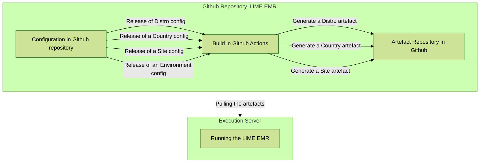

# MSF-OCG LIME EMR
The OpenMRS 3 distribution for MSF OCG

<div>


</div>

## A Generic Light Modular EMR using

<div>

</div>

## Integration with

<div>
<td></td>
<td>&nbsp;&nbsp;&nbsp;&nbsp;&nbsp;&nbsp;&nbsp;&nbsp;</td>
<td>&nbsp;&nbsp;&nbsp;&nbsp;&nbsp;&nbsp;&nbsp;&nbsp;</td>
<td>&nbsp;&nbsp;&nbsp;&nbsp;&nbsp;&nbsp;&nbsp;&nbsp;</td>
</div>

## Technical documentation of the project
[https://msf-ocg.github.io/LIME-EMR-project-demo](https://msf-ocg.github.io/LIME-EMR-project-demo)


## Quick Start

Build

```bash
./scripts/mvnw clean package
```

Running MSF Distro

```bash
source distro/target/go-to-scripts-dir.sh
./start-demo.sh
```

Running MSF Iraq

```bash
cd countries/iraq/target/ozone-msf-iraq-<version>/run/docker/scripts
./start-demo.sh
```

Running MSF Mosul

```bash
cd sites/mosul/target/ozone-msf-mosul-<version>/run/docker/scripts
./start-demo.sh
```
> Note: By default, OpenMRS will start on port 4001.
To change the port, modify the PROXY_PUBLIC_PORT variable in the `.env` file (/run/docker/.env).


## Ambitions and success criteria

- Integrated – with OpenMRS ecosystem and community roadmap
- Innovative – leveraging modern technology and approaches
- Sustainable – using well maintained and documented tools and practices
- Open – using open-source software and licenses allowing for reusability
- Data driven – quality information will be available to the right people when they need it
- Quality of care – address tangible needs from health care workers and patients
- Relevant – content and patient flows representative of use cases defined healthcare workers
- Harmonized – content is following global standards such as ICD, SNOMED, etc.
- Portable – agnostic architecture, containerization, and orchestration
- Adaptable – content and configuration management that can easily be updated
- Recoverable – recommendations for a solid backup and recovery strategy
- Testable – automated testing and reporting whenever possible
- Secure – architecture and practices to meet GDPR and HIPAA regulations
- Reliable – recommendations to support redundancy, failover, and monitoring by design
- Interoperable – to support Health Information Exchange (HIE) and standards such as HL7 FHIR
- Collaborative – share information, insights, strategies and deliverables within the community
- Achievable – taking in account the overall roadmap and challenges of implementers


## Key features

### Program-specific content
- **Mental health** forms (7 forms - PHQ9, MHPSS and mhGap)

### Multilingual UI and forms
- **Arabic and English** support. You can read more about the [implementation here](/docs/translations.md)

### Role-based access control (RBAC)
- Role-based **appointments**
- Role-based **forms**
- Role-based **encounters**
- Role-based **form modification**

### Advanced form configuration
- Answer-based **filter for questions**
- Role-based **write privilege**
- Get **previous observations**
- Score **Calculations**

### Printing
- Patient **identification stickers** in registration with barcodes

### Visit management
- Auto-close **OPD Visits** nightly

### Data exchange and interoperability
- Syncing automatically data between **OpenMRS and DHIS2 Tracker** using OpenFN

## Configuration hierarchy and inheritance

### Assumptions
- There are **3 levels** of configurations: Distro < Country < Site
- The default **ineritance logic** is for lower levels to overwrite above ones
- **Configurations** includes backend and frontend binaries, frontend configs, initializer metadata, and assets like logos.
- It **primarly support OpenMRS**, but aims to be flexible and also support Senaite, Superset, OpenFN, FHIR, etc.

#### Hierarchy overview - example
```
── pom.xml - Aggredator / Orchestrator
      └── /distro/pom.xml - Organizational-wide Config
      └── /countries - Country-specific Config
            └── /iraq/pom.xl
      └── /sites - Site-specific Config
            └── /mosul/pom.xl
```

### Workflow diagram



## Example for configs for hierarchy demo of v1 - Week of April 8

### Ozone Level **OpenMRS RefApp**

- [X] Refapp stable version of [modules for frontend](https://github.com/openmrs/openmrs-distro-referenceapplication/blob/main/frontend/spa-assemble-config.json)
- [X] Refapp stable version of [modules for backend](https://github.com/openmrs/openmrs-distro-referenceapplication/blob/main/distro/pom.xml)

### MSF Distro **LIME EMR** repository

- [X] MSF [branding in frontend config](https://github.com/MSF-OCG/LIME-EMR-project-demo/blob/main/frontend/custom-config.json)
- [X] MSF [logo and assets](https://github.com/MSF-OCG/LIME-EMR-project-demo/tree/main/frontend/assets)
- [X] [Env specific logos](https://github.com/MSF-OCG/LIME-EMR-project-demo/blob/dev/frontend/qa/assets/logo.png) for users to easily identify their environment

### Country level: **Iraq**

- [X] [Roles config](https://github.com/MSF-OCG/LIME-EMR-project-demo/blob/main/distro/configuration/roles/roles_core-demo.csv) for Initializer

### Site level: **Mosul**

- [X] [Address hierarchy](https://github.com/MSF-OCG/LIME-EMR-project-demo/tree/main/distro/configuration/addresshierarchy) for Initializer
- [X] [Locations](https://github.com/MSF-OCG/LIME-EMR-project-demo/blob/main/distro/configuration/locations/locations.csv) for Initializer
- [X] [Person attributes](https://github.com/MSF-OCG/LIME-EMR-project-demo/blob/main/distro/configuration/personattributetypes/personattributetypes_core-demo.csv) for Initializer
- [X] [Initial consultation form](https://github.com/MSF-OCG/LIME-EMR-project-demo/blob/main/distro/configuration/ampathforms/initial_consultation-lime_demo.json)


## Maven configuration
Sometimes, you might need to customize your Maven configuration file to build the project.

On Mac, you can edit those settings using: `vi ~/.m2/settings.xml`

Add the below Maven Server config and API key to your system's Maven settings. Refer to [this doc](https://docs.github.com/en/authentication/keeping-your-account-and-data-secure/managing-your-personal-access-tokens#creating-a-fine-grained-personal-access-token) to create API Key.

```xml
  <servers>
    <server>
      <id>msf-ocg-github-lime-emr</id>
      <username>YOUR_GITHUB_USERNAME</username>
      <password>YOU_GITHUB_TOKEN</password>
    </server>
  </servers>
```


#### Enable SSL (i.e., Run with Traefik Enabled)

To enable SSL, start the server with Traefik, use the following command:

```bash
export TRAEFIK="true" && ./start-demo.sh
```

This will allow you to access the server either using `*.traefik.me` or the usual `localhost`: (See image below)


> Note: With ssl enabled, OpenMRS will remain locally accessible via `http://localhost:4001/openmrs`.

## Testing

1. Install prerequisites
   brew install jq
2. Clone EMR Tooling
3. Update install directory

   ```bash
   INSTALL_DIR="**.**/home/lime/$APP_NAME"
   ```
4. Disable logging in lime_emr.sh (success and error)
   Function to log success messages

```bash
log_success() {
    echo "[$(date +'%Y-%m-%dT%H:%M:%S%z')] Success: $1" # >> "$SUCCESS_LOG"
}
```

Comment out Function to log error messages

```bash
log_error() {
    echo "[$(date +'%Y-%m-%dT%H:%M:%S%z')] Error: $1" # >> "$ERROR_LOG"
}
```

6. Comment out download_msf_artefact() function

```bash
   # curl -L -o "$download_name.zip" -H "$GITHUB_REQUEST_TYPE" -H "$GITHUB_AUTH_HEADER" -H "$GITHUB_API_VERSION" "$download_url" && log_success "Downloaded MSF Distro for the '$artifact_branch' branch." || log_error "Failed to download MSF Distro for the '$artifact_branch' branch."
```

7. Remove docker and package installation if needed
8. Run installation script
   chmod +x ./Procedures/lime_emr.sh
   sh ./Procedures/lime_emr.sh install mosul

## Roadmap

- [ ] In pom files, implement a **merge logic for frontend config JSONs** at the site level. It will merge frontend configs from the Distro, Country, and Site level together. The lower level will always overwrite the above level in case of conflicts. Example: [externalRefLinks for the esm-primary-navigation-app](https://github.com/MSF-OCG/LIME-EMR/blob/main/sites/mosul/configs/openmrs/frontend_config/msf-frontend-config.json)
- [ ] In pom files, replicate a similar logic for **initializer configuration files** - assumung that the lower level also always overwrite the above one.
- [ ] Simplify the **results of the build** currently generating muliple targets for all levels, rather than a single one for the execution level, being the Site level. Example: [ozone-msf-mosul-1.0.0-SNAPSHOT](https://github.com/MSF-OCG/LIME-EMR/packages/2120035)
- [ ] Ensure that the **Github Action build** is running the right level of configs upon release or manual trigger - not triggering all of them aspecially for performance savings pursposes:
  ``

---

## [Configuration](#configuration)

### [OpenMRS Configuration](#openmrs_configuration "OpenMRS Configuration")

##### [Backend configuration](#backend-configuration)

We use the maven's `pom.xml` file at the root of each level to define what configuration should be applied.
We embrace maven's [maven resources plugin](https://maven.apache.org/plugins/maven-resources-plugin) to exclude/filter and include configs as different execution processes using the `copy-resources` goal.  This allows us to add or remove files while copying them form the parent level to the current level's build directory after the parent's download.

- ###### [How to use the maven resources plugin](#how-to-use-the-maven-resources-plugin)


  ```xml
  <plugin>
      <groupId>org.apache.maven.plugins</groupId>
      <artifactId>maven-resources-plugin</artifactId>
      <executions>
          <!-- add executions to filter or add a file -->
      </executions>
  </plugin>
  ```
- ###### [Excluding/Filtering files from parent level](#excluding-files-from-parent-level)


  ```xml
  <plugin>
      <artifactId>maven-resources-plugin</artifactId>
      ...
      <execution>
          <id>Exclude unneeded Ozone files</id>
          <phase>process-resources</phase>
          <goals>
              <goal>copy-resources</goal>
          </goals>
          <configuration>
              <outputDirectory>
                  <!-- destination of the file to copy-->
                  ${project.build.directory}/${project.artifactId}-${project.version}
              </outputDirectory>
              <overwrite>true</overwrite>
              <resources>
              <resource>
                  <directory>${project.build.directory}/ozone</directory> <!-- source of the file to copy -->
                  <excludes>
                  <!-- exclude unneeded files here like: <exclude>distro/configs/**/ampathforms/*.*</exclude> -->
                  </excludes>
              </resource>
              </resources>
          </configuration>
      </execution>
      ...
  </plugin>
  ```
- ###### [Including files to current level](#including-files-to-current-level)


  ```xml
  <plugin>
      <artifactId>maven-resources-plugin</artifactId>
      ...
      <execution>
          <id>Copy MSF Disto docker compose .txt file</id>
          <phase>prepare-package</phase>
          <goals>
              <goal>copy-resources</goal>
          </goals>
          <configuration>
              <outputDirectory>
                  <!-- destination of the file to copy-->
                  ${project.build.directory}/${project.artifactId}-${project.version}/run/docker/scripts
              </outputDirectory>
              <overwrite>true</overwrite>
              <resources>
              <resource>
                  <directory>${project.basedir}/../scripts</directory> <!-- source of the file to copy-->
                  <includes>
                  <!-- add more needed files here like: <include> docker-compose-files.txt</include> -->
                  </includes>
              </resource>
              </resources>
          </configuration>
      </execution>
      ...
  </plugin>
  ```

  ###### [Initializer Data](#initializer-data)

  At the current level, metadata is loaded through the Initializer module. A CSV file is added to the `configs/openmrs/initializer_config` folder at the current level and if the parent level defines the same `.csv` file, the corresponding file is excluded like showed below. Read more about the initializer configuration [here](https://github.com/mekomsolutions/openmrs-module-initializer/blob/master/README.md#introduction).

  `<strong>`Example `</strong>`

  

---

##### [Frontend Configuration](#frontend-configuration)

MSF configuration are loaded using the [msf-frontend-config.json](https://github.com/MSF-OCG/LIME-EMR/blob/main/distro/configs/openmrs/frontend_config/msf-frontend-config.json)
We use the [Apache Maven AntRun Plugin](https://maven.apache.org/plugins/maven-antrun-plugin/) to execute a task that replaces the ozone configuration file in the `.env` file that docker compose uses while building the frontend. The `.env` file is located in the `target/run/docker/.env` at the current level.

Below is how its done

```xml
<plugin>
    <groupId>org.apache.maven.plugins</groupId>
    <artifactId>maven-antrun-plugin</artifactId>
    <version>3.1.0</version>
    <executions>
        <execution>
        <id>Add MSF-OCG LIME Frontend Configuration to ozone</id>
        <phase>process-resources</phase>
        <goals>
            <goal>run</goal>
        </goals>
        <configuration>
            <target>
            <echo message="Adding msf frontend config"/>
            <replaceregexp
                file="${project.build.directory}/${project.artifactId}-${project.version}/run/docker/.env"
                match="ozone-frontend-config.json"
                replace="msf-frontend-config.json"
            />
            </target>
        </configuration>
        </execution>
    </executions>
</plugin>
```

This task replaces all the occurrences of the sting `ozone-frontend-config.json` with `msf-frontend-config.json`
After building the project using maven, the  `SPA_CONFIG_URLS` variable (it specifies the location of the frontend config file inside docker) in the `.env` file will have a value of `/openmrs/spa/ozone/msf-frontend-config.json`

> Note: Docker compose will only load the file passed to the `SPA_CONFIG_URLS` in the `.env` file.  This means that any other file present in the `target` but not added to the `SPA_CONFIG_URLS` will be ignored.

###### [Inheritance in Frontend Configuration](#inheritance-in-frontend-configuration)

The OpenMRS frontend tooling supports loading a frontend configuration on top of the currently loaded configuration.  This means that we can use one file to load general frontend configuration like at `Organization level` branding and logos, and at site level, an `obs-table` on top of the patient chart.   Both these configuration will be loaded successfully.

We can also use the child frontend configuration file to override the inherited frontend configuration. This implies that each level should have its own frontend configuration file in case it needs to load new frontend configuration.

`<strong>`Examples `</strong>`

- At organization level
  in pom.xml file

  ```xml
  <replaceregexp
      file="${project.build.directory}/${project.artifactId}-${project.version}/run/docker/.env"
      match="ozone-frontend-config.json"
      replace="msf-frontend-config.json"
  />
  ```

  result to the `.env` file after build

  ```properties
  SPA_CONFIG_URLS=/openmrs/spa/ozone/msf-frontend-config.json
  ```
- Site frontend configuration inheriting from Organization level
  in pom.xml file

  ```xml
  <replaceregexp
      file="${project.build.directory}/${project.artifactId}-${project.version}/run/docker/.env"
      match="(SPA_CONFIG_URLS=.+)"
      replace="\1,/openmrs/spa/ozone/msf-mosul-frontend-config.json"
  />
  ```

  result to the `.env` file after build

  ```properties
  SPA_CONFIG_URLS=/openmrs/spa/ozone/msf-frontend-config.json, /openmrs/spa/ozone/msf-mosul-frontend-config-json
  ```

---

### [OpenFn Configuration](#openfn_configuration)

**Note:** This configuration is still a work in progress. Expect further changes to enhance and streamline the workflow.

#### [Docker Compose Configuration](docker_compose_configuration)

##### Step 1: Use Linux Images

To ensure compatibility, we forced Docker Compose to use Linux images for OpenFn and updated our `docker-compose-openfn.yml` file as follows:

```yaml
services:
  ws-worker:
    image: openfn/ws-worker:latest
    platform: linux/x86_64/v8
  lightening:
    image: openfn/lightening:latest
    platform: linux/x86_64/v8
```

##### Step 2: Add ERL_FLAGS Environment Variable

To solve the `ArgumentError`, add the `ERL_FLAGS` environment variable to our `openFn.env` file:

```sh
ERL_FLAGS="+JPperf true"
```

You can also do the same inside Docker Compose:

```yaml
services:
  ws-worker:
    environment:
      - ERL_FLAGS="+JPperf true"
```

#### [OpenFn Azure Configuration](#openfn_azure_configuration)

##### Step 1: Update Origins

Add the Azure domain to the `ORIGINS` variable in the `openFn.env` file:

```sh
ORIGINS="http://your-azure-domain.com"
```

#### [OpenFn Workflow Inheritance Configuration](openfn_workflow_configuration))

We use a simple Groovy script to merge all `.yaml` files in the `./config/openfn` directory on each level (`distro`, `iraq`, or `mosul`) at compile time to generate the `openfn-project.yaml` file containing all OpenFn projects and corresponding workflows.

**Assumptions:**

* Config file name can be anything except `openfn-project.yaml`.
* Config should have a `.yaml` extension.
* Config should be in `./config/openfn` at compile time.

##### Adding OpenFn Workflows on a Specific Level

To exclude the parent compiled `openfn-project.yaml` workflow file (e.g., at the Mosul level), update the Maven configuration:

```xml
<plugin>
    <groupId>org.apache.maven.plugins</groupId>
    <artifactId>maven-resources-plugin</artifactId>
    <version>3.3.1</version>
    <executions>
        <execution>
            <id>Copy Ozone MSF files</id>
            <phase>process-resources</phase>
            <goals>
                <goal>copy-resources</goal>
            </goals>
            <configuration>
                <outputDirectory>${project.build.directory}/${project.artifactId}-${project.version}</outputDirectory>
                <overwrite>true</overwrite>
                <resources>
                    <resource>
                        <directory>${project.build.directory}/ozone-msf-iraq</directory>
                        <excludes>
                            <exclude>distro/configs/openfn/openfn-project.yaml</exclude>
                        </excludes>
                    </resource>
                </resources>
            </configuration>
        </execution>
    </executions>
</plugin>
```

##### Execute the YAML Merging Script

```xml
<plugin>
    <groupId>org.codehaus.gmavenplus</groupId>
    <artifactId>gmavenplus-plugin</artifactId>
    <version>${gmavenplusPluginVersion}</version>
    <executions>
        <execution>
            <id>combine openfn project.yaml files in Mosul</id>
            <goals>
                <goal>execute</goal>
            </goals>
            <phase>process-resources</phase>
            <configuration>
                <scripts>
                    <script>file://${project.build.directory}/${project.artifactId}-${project.version}/run/docker/scripts/merge-openfn-yaml.groovy</script>
                </scripts>
            </configuration>
        </execution>
    </executions>
    <dependencies>
        <dependency>
            <groupId>org.apache.groovy</groupId>
            <artifactId>groovy</artifactId>
            <version>4.0.15</version>
            <scope>runtime</scope>
        </dependency>
    </dependencies>
</plugin>
```

##### Adding Workflow Files

Ensure your workflow file is placed inside `./config/openfn`.

---

## [FAQ](#faq)

## Release Notes

### 1.0.0-SNAPSHOT (in progress)

### Automated QA
This project is tested with BrowserStack
