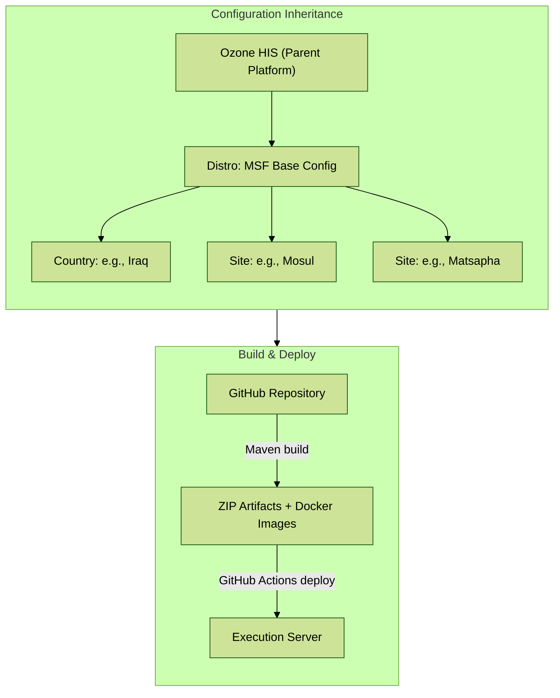
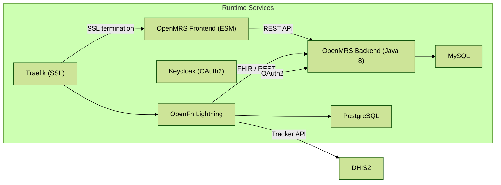
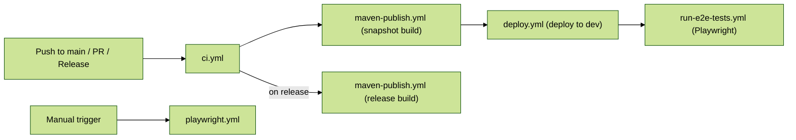

# MSF-OCG LIME EMR

**LIME EMR** (Light Modular EMR) is an [OpenMRS 3](https://openmrs.org/) distribution built by [MSF](https://www.msf.org/) OCG (Operational Centre Geneva). It provides a generic, modular Electronic Medical Record system for humanitarian healthcare settings, with multi-site deployments across Iraq and Eswatini.

The system is built on the [Ozone HIS](https://www.ozone-his.com/) platform and integrates with [DHIS2](https://dhis2.org/) for health information reporting, [OpenFn](https://www.openfn.org/) for workflow automation, [OpenConceptLab](https://openconceptlab.org/) for terminology management, and [HL7 FHIR](https://www.hl7.org/fhir/) for health data interoperability.

<table>
  <tr>
    <td rowspan="3" width="70%">
      
    </td>
    <td>
      
    </td>
  </tr>
  <tr>
    <td>
      
    </td>
  </tr>
  <tr>
    <td>
      
    </td>
  </tr>
</table>

**Technical documentation**: [https://msf-ocg.github.io/LIME-EMR](https://msf-ocg.github.io/LIME-EMR)

---

## Table of Contents

1. [Overview](#1-overview)
2. [Architecture](#2-architecture)
3. [Quick Start](#3-quick-start)
   - 3.1 [Distro](#31-distro)
   - 3.2 [Site](#32-site)
4. [Project Structure](#4-project-structure)
   - 4.1 [Inheritance Hierarchy](#41-inheritance-hierarchy)
   - 4.2 [Adding a New Site](#42-adding-a-new-site)
   - 4.3 [Build System](#43-build-system)
5. [Features](#5-features)
   - 5.1 [Infrastructure](#51-infrastructure)
     - 5.1.1 [HTTPS](#511-https)
     - 5.1.2 [Bundled Docker](#512-bundled-docker)
     - 5.1.3 [CI/CD](#513-cicd)
   - 5.2 [Configuration](#52-configuration)
     - 5.2.1 [OpenMRS](#521-openmrs)
       - 5.2.1.1 [Clinical Forms](#5211-clinical-forms)
       - 5.2.1.2 [Address Hierarchy](#5212-address-hierarchy)
     - 5.2.2 [OpenFn](#522-openfn)
       - 5.2.2.1 [Project Workflows and State Files](#5221-project-workflows-and-state-files)
       - 5.2.2.2 [Credentials](#5222-credentials)
6. [How To](#6-how-to)
7. [Release Notes](#7-release-notes)

---

## 1. Overview

LIME EMR is a **generic, light, modular** Electronic Medical Record system designed for MSF's humanitarian healthcare operations. It is built on [OpenMRS 3](https://openmrs.org/) and the [Ozone HIS](https://www.ozone-his.com/) distribution platform.

### Current Deployment Sites

| Site | Country | Clinical Forms | Description |
|------|---------|---------------|-------------|
| **Distro** (MSF base) | — | 14 forms | Core programs: mental health, family planning, HIV, social work, gynaecology, referral & discharge |
| **Mosul** | Iraq | 75+ forms | Full hospital: surgery, ER, maternity, paediatrics, neonatology, ICU, infectious diseases, palliative care, nutrition, specialized programs. Arabic/English. DHIS2 sync via OpenFn. |
| **Matsapha** | Eswatini | Inherits distro | Recently added site with custom branding, address hierarchy, ID generation, and OpenFn configuration |

### Key Capabilities

- **Clinical forms** — 75+ JSON-based forms across mental health, surgery, obstetrics, infectious diseases, and more
- **Multilingual** — Arabic and English UI and form translations
- **Role-based access control** — Role-based forms, appointments, encounters, and data filtering
- **Data exchange** — Real-time OpenMRS ↔ DHIS2 Tracker synchronization via OpenFn
- **Interoperability** — FHIR R4 API, OpenConceptLab terminology, REST web services
- **Multi-site** — Three-level configuration inheritance (Distro → Country → Site)
- **Containerized** — Docker Compose orchestration with optional Traefik SSL

### Ambitions and Success Criteria

- **Integrated** – with OpenMRS ecosystem and community roadmap
- **Innovative** – leveraging modern technology and approaches
- **Sustainable** – using well maintained and documented tools and practices
- **Open** – using open-source software and licenses allowing for reusability
- **Data driven** – quality information available to the right people when they need it
- **Quality of care** – address tangible needs from healthcare workers and patients
- **Relevant** – content and patient flows representative of use cases defined by healthcare workers
- **Harmonized** – content following global standards such as ICD, SNOMED, etc.
- **Portable** – agnostic architecture, containerization, and orchestration
- **Adaptable** – content and configuration management that can easily be updated
- **Recoverable** – recommendations for a solid backup and recovery strategy
- **Testable** – automated testing and reporting whenever possible
- **Secure** – architecture and practices to meet GDPR and HIPAA regulations
- **Reliable** – recommendations to support redundancy, failover, and monitoring by design
- **Interoperable** – to support Health Information Exchange (HIE) and standards such as HL7 FHIR
- **Collaborative** – share information, insights, strategies and deliverables within the community
- **Achievable** – taking into account the overall roadmap and challenges of implementers

---

## 2. Architecture

LIME EMR follows a **three-level configuration inheritance model** designed for multi-site humanitarian deployments:

1. **Distro** (`/distro`) — Organization-wide MSF base configuration. Defines backend modules, frontend modules, core clinical forms, concept dictionaries, drug lists, roles, and branding shared across all MSF sites.
2. **Country** (`/countries/<name>`) — Country-specific overrides (e.g., Iraq-specific metadata or roles).
3. **Site** (`/sites/<name>`) — Site-specific overrides. Adds address hierarchies, locations, ID generation, site-specific clinical forms, translations, and OpenFn workflows for a particular facility.

Each lower level inherits everything from the level above and can selectively override or extend any configuration file. The build system (Maven) orchestrates this by unpacking the parent artifact, then copying and excluding files at each level.



### Runtime Services

The system runs as a set of Docker containers orchestrated by Docker Compose:



### Technology Stack

| Layer | Technologies |
|-------|-------------|
| **Backend** | OpenMRS Core 2.7.6, Java 8, 20+ OpenMRS modules (FHIR2, Initializer, Appointments, Queue, Forms, Reporting, etc.) |
| **Frontend** | OpenMRS 3 ESM microfrontend architecture (Core UI 8.0.1, Patient Chart 11.3.1, 40+ modules), plus custom Madiro modules (Nutrition, Mental Health) |
| **Data exchange** | OpenFn Lightning for DHIS2 sync, FHIR R4 API, OpenConceptLab |
| **Infrastructure** | Docker Compose, Traefik v2.6 (SSL), Keycloak (OAuth2), MySQL, PostgreSQL |
| **Build** | Apache Maven (multi-module aggregator), GitHub Actions CI/CD, GitHub Packages |
| **Testing** | Playwright v1.49.0 (E2E), BrowserStack |

---

## 3. Quick Start

### Prerequisites

- Java 8+
- Maven 3.x (a Maven wrapper `./scripts/mvnw` is included)
- Docker and Docker Compose
- A GitHub personal access token configured in `~/.m2/settings.xml` (see [Build System](#43-build-system))

### Build

```bash
./scripts/mvnw clean package
```

### 3.1 Distro

Run the base MSF distribution (organization-wide defaults):

```bash
source distro/target/go-to-scripts-dir.sh
./start-demo.sh
```

> OpenMRS will be available at `http://localhost:4001/openmrs`.
> To change the port, modify `PROXY_PUBLIC_PORT` in `/run/docker/.env`.

### 3.2 Site

Run a specific site (includes all distro configuration plus site-specific overrides):

**Mosul (Iraq):**
```bash
cd sites/mosul/target/ozone-msf-mosul-<version>/run/docker/scripts
./start-demo.sh
```

**Matsapha (Eswatini):**
```bash
cd sites/matsapha/target/ozone-msf-matsapha-<version>/run/docker/scripts
./start-demo.sh
```

**Iraq (country-level, without site-specific config):**
```bash
cd countries/iraq/target/ozone-msf-iraq-<version>/run/docker/scripts
./start-demo.sh
```

---

## 4. Project Structure

```
LIME-EMR/
├── pom.xml                              # Root Maven aggregator
├── distro/                              # Organization-wide (MSF) base configuration
│   ├── pom.xml                          # Backend module versions & build plugins
│   └── configs/openmrs/
│       ├── frontend_assembly/           # spa-assemble-config.json (frontend module versions)
│       ├── frontend_config/             # msf-frontend-config.json (branding, UI settings)
│       └── initializer_config/          # Base clinical metadata
│           ├── ampathforms/             # 14 clinical form definitions (JSON)
│           ├── concepts/                # Medical concept definitions
│           ├── drugs/                   # Drug database
│           ├── encountertypes/          # Encounter type definitions
│           ├── patientidentifiertypes/  # Patient ID types
│           ├── roles/                   # User roles
│           ├── privileges/              # System privileges
│           ├── globalproperties/        # OpenMRS global properties
│           └── ...                      # Additional initializer domains
├── countries/
│   └── iraq/                            # Country-level overrides for Iraq
│       └── configs/openmrs/initializer_config/
├── sites/
│   ├── mosul/                           # Mosul site (Iraq)
│   │   ├── configs/openmrs/
│   │   │   ├── initializer_config/
│   │   │   │   ├── ampathforms/         # 75+ site-specific clinical forms
│   │   │   │   ├── ampathformstranslations/  # Arabic & English translations
│   │   │   │   ├── addresshierarchy/    # Iraq geographic hierarchy
│   │   │   │   ├── locations/           # Facility locations
│   │   │   │   └── idgen/               # Patient ID generation
│   │   │   └── frontend_config/         # msf-mosul-frontend-config.json
│   │   └── configs/openfn/              # OpenFn workflows for DHIS2 sync
│   └── matsapha/                        # Matsapha site (Eswatini)
│       ├── configs/openmrs/             # Address hierarchy, locations, ID generation
│       └── configs/openfn/              # OpenFn workflow configuration
├── environment/                         # Environment-specific branding (QA, UAT, Prod)
├── scripts/                             # Docker Compose files, build utilities, env files
├── e2e/                                 # Playwright end-to-end tests
├── docs/                                # Technical documentation
└── .github/workflows/                   # CI/CD pipelines
```

### 4.1 Inheritance Hierarchy

The project is a Maven multi-module aggregator. Each module inherits from the level above and can override any configuration file.

```
pom.xml                          # Root aggregator / orchestrator
├── distro/pom.xml               # Organization-wide config (MSF)
├── countries/iraq/pom.xml       # Country config (inherits distro)
├── sites/mosul/pom.xml          # Site config (inherits distro)
└── sites/matsapha/pom.xml       # Site config (inherits distro)
```

**How inheritance works at build time:**

1. **Download** — Maven downloads the parent level's artifact (ZIP) from GitHub Packages
2. **Unpack** — The artifact is unpacked into the build directory
3. **Exclude** — Files that the current level overrides are excluded via `maven-resources-plugin`
4. **Copy** — The current level's own configuration files are copied on top
5. **Post-process** — Groovy scripts merge OpenFn YAML files; AntRun updates `.env` variables
6. **Package** — The result is packaged as a new ZIP artifact

**Configuration types that can be overridden at each level:**
- Backend OpenMRS modules (JARs)
- Frontend ESM modules (JS bundles)
- Frontend JSON config files (branding, UI widgets, dashboards)
- Initializer metadata (CSV/JSON: forms, concepts, drugs, roles, locations, etc.)
- Static assets (logos, branding images)
- OpenFn workflow definitions (YAML)
- Docker Compose overrides

**Frontend config inheritance** uses `SPA_CONFIG_URLS` in the Docker `.env` file to load multiple JSON configs in order, with later files overriding earlier ones:
```properties
# Distro-level only:
SPA_CONFIG_URLS=/openmrs/spa/configs/msf-frontend-config.json

# Site-level (inherits distro + adds site overrides):
SPA_CONFIG_URLS=/openmrs/spa/configs/msf-frontend-config.json,/openmrs/spa/configs/msf-mosul-frontend-config.json
```

### 4.2 Adding a New Site

To add a new site (e.g., `sites/newsite`), follow these steps:

**Step 1. Create the directory structure:**

```
sites/newsite/
├── pom.xml
├── assembly.xml
└── configs/
    ├── openmrs/
    │   ├── frontend_config/
    │   │   └── msf-newsite-frontend-config.json
    │   └── initializer_config/
    │       ├── addresshierarchy/         # Site-specific address hierarchy CSV + XML
    │       ├── locations/                # Facility location definitions
    │       ├── idgen/                    # Patient ID generation schemes
    │       ├── visittypes/               # Visit type definitions
    │       ├── appointmentservicedefinitions/
    │       └── ...                       # Any other overrides
    └── openfn/
        ├── newsite-project.yaml          # OpenFn workflow definitions
        ├── projectState.json             # OpenFn credentials and project metadata
        ├── adaptor_registry_cache.json   # Cached OpenFn adaptor versions
        └── version.txt
```

**Step 2. Create `pom.xml`** — Use `sites/matsapha/pom.xml` as a template. Key elements:

```xml
<groupId>com.ozonemsf</groupId>
<artifactId>ozone-msf-newsite</artifactId>
<version>1.0.0-SNAPSHOT</version>
<packaging>pom</packaging>

<dependencies>
  <dependency>
    <artifactId>ozone-msf-distro</artifactId>
    <groupId>com.ozonemsf</groupId>
    <version>1.0.0-SNAPSHOT</version>
    <type>zip</type>
  </dependency>
</dependencies>
```

The pom.xml must include Maven plugins to:
- **Unpack** the distro artifact (`maven-dependency-plugin`)
- **Exclude** distro files being replaced (`maven-resources-plugin`) — typically `addresshierarchy`, `locations`, `idgen`, `visittypes`, `appointmentservicedefinitions`
- **Copy** site-specific configs on top (`maven-resources-plugin`)
- **Update** the `.env` file with the site frontend config URL (`maven-antrun-plugin`)
- **Merge** OpenFn YAML files (`gmavenplus-plugin` with `merge-openfn-yaml.groovy`)
- **Package** as ZIP (`maven-assembly-plugin`)

**Step 3. Create `assembly.xml`** — Copy from any existing site (they are identical):

```xml
<assembly>
  <id>zip</id>
  <formats><format>zip</format></formats>
  <includeBaseDirectory>false</includeBaseDirectory>
  <fileSets>
    <fileSet>
      <outputDirectory>.</outputDirectory>
      <directory>${project.build.directory}/${project.artifactId}-${project.version}</directory>
    </fileSet>
  </fileSets>
</assembly>
```

**Step 4. Register the module** in the root `pom.xml`:

```xml
<modules>
  <module>distro</module>
  <module>countries/iraq</module>
  <module>sites/mosul</module>
  <module>sites/matsapha</module>
  <module>sites/newsite</module>    <!-- Add this line -->
</modules>
```

**Step 5. Build and verify:**

```bash
./scripts/mvnw clean package -pl sites/newsite -am
cd sites/newsite/target/ozone-msf-newsite-<version>/run/docker/scripts
./start-demo.sh
```

### 4.3 Build System

The project uses **Apache Maven** as its build system, organized as a multi-module aggregator.

#### Maven Profiles

| Profile | Description |
|---------|-------------|
| `local` (default) | Uses `local.msf.env`, Traefik disabled |
| `azure` | Uses `azure.msf.env`, Traefik enabled with SSL |
| `production` | Sets Docker tag to `latest` |
| `bundled-docker` | Builds Docker images with multi-platform support (see [Bundled Docker](#512-bundled-docker)) |

#### Key Maven Plugins

| Plugin | Purpose |
|--------|---------|
| `maven-dependency-plugin` | Unpacks parent-level ZIP artifacts |
| `maven-resources-plugin` | Copies/excludes/filters configuration files between levels |
| `maven-antrun-plugin` | Replaces frontend config references and other strings in `.env` files |
| `gmavenplus-plugin` | Runs Groovy scripts (e.g., merging OpenFn YAML files, generating `ozone-info.json`) |
| `maven-assembly-plugin` | Packages the final ZIP artifact |
| `merge-maven-plugin` | Merges `.env` files from multiple sources |
| `docker-maven-plugin` (Fabric8) | Builds and pushes Docker images (bundled-docker profile) |

#### Maven Configuration

Add GitHub Packages credentials to `~/.m2/settings.xml`:

```xml
<servers>
  <server>
    <id>msf-ocg-github-lime-emr</id>
    <username>YOUR_GITHUB_USERNAME</username>
    <password>YOUR_GITHUB_TOKEN</password>
  </server>
</servers>
```

See [creating a personal access token](https://docs.github.com/en/authentication/keeping-your-account-and-data-secure/managing-your-personal-access-tokens#creating-a-fine-grained-personal-access-token) for token setup.

---

## 5. Features

### 5.1 Infrastructure

#### 5.1.1 HTTPS

LIME EMR supports HTTPS via **Traefik v2.6** as a reverse proxy with automatic SSL certificates from [traefik.me](https://traefik.me).

**To enable HTTPS:**
```bash
export TRAEFIK="true" && ./start-demo.sh
```

**How it works:**
- An init container (`reverse-proxy-https-helper`) downloads wildcard SSL certificates from traefik.me
- Traefik terminates SSL and proxies requests to the OpenMRS frontend, OpenFn Lightning, and other services
- Domains are generated dynamically using the server's IP address:
  - `https://api-<IP>.traefik.me` — OpenMRS
  - `https://openfn-<IP>.traefik.me` — OpenFn Lightning
- The Traefik admin dashboard is protected with basic authentication (`TRAEFIK_ADMIN_USER` / `TRAEFIK_ADMIN_PASSWORD`)
- Ports: HTTP (80) and HTTPS (443)

> **Note**: With SSL enabled, OpenMRS remains locally accessible at `http://localhost:4001/openmrs`.

**For Azure deployments**, set the `ORIGINS` environment variable in the OpenFn environment file to include the Azure domain.

#### 5.1.2 Bundled Docker

The `bundled-docker` Maven profile builds pre-configured Docker images and pushes them to Docker Hub under the `msfocg` registry.

**Activate with:**
```bash
./scripts/mvnw clean package -Pbundled-docker
```

**Images built (8 total):**

| Image | Platforms | Description |
|-------|-----------|-------------|
| `msfocg/<site>-openmrs-backend` | amd64, arm64 | OpenMRS backend with all modules pre-installed |
| `msfocg/<site>-openmrs-frontend` | amd64, arm64 | OpenMRS frontend SPA with all ESM modules |
| `msfocg/<site>-proxy` | amd64, arm64 | Nginx reverse proxy |
| `msfocg/<site>-mysql` | amd64, arm64 | MySQL with pre-loaded database |
| `msfocg/<site>-postgresql` | amd64, arm64 | PostgreSQL with OpenFn database init scripts |
| `msfocg/<site>-openfn-web` | amd64 only | OpenFn Lightning web application |
| `msfocg/<site>-openfn-worker` | amd64 only | OpenFn worker with workflows and project state |

**Tag strategy:**
- `dev` tag by default
- `latest` tag when built with the `production` profile

At the site level, the bundled Docker build also injects site-specific OpenFn configuration (workflow YAML, project state, adaptor cache) into the OpenFn worker and web images.

#### 5.1.3 CI/CD

The project uses **GitHub Actions** for continuous integration and deployment. Workflows are defined in `.github/workflows/`.



| Workflow | Trigger | Purpose |
|----------|---------|---------|
| `ci.yml` | Push to `main`, PRs, releases, manual | Main orchestrator — chains build, deploy, and test jobs |
| `maven-publish.yml` | Called by `ci.yml` | Builds all Maven modules, publishes to GitHub Packages and Docker Hub |
| `deploy.yml` | Called by `ci.yml` | Deploys to target environment with optional Traefik SSL |
| `run-e2e-tests.yml` | Called by `ci.yml` | Runs Playwright E2E tests against deployed environment |
| `playwright.yml` | Manual dispatch | Standalone Playwright test execution |
| `configuration-build-test.yml` | PR | Validates that configuration builds succeed |
| `cleanup-artifacts.yml` | Scheduled | Removes old build artifacts |

**E2E Testing** uses [Playwright](https://playwright.dev/) v1.49.0 with Chromium. Test coverage includes:
- OpenMRS and OpenFn login flows
- Mental health form workflows (MHPSS baseline, mhGAP baseline/follow-up)
- Answer-based question filtering
- Arabic/English translation verification
- Visit management

```bash
# Run all E2E tests locally
yarn test:e2e

# Run only login tests
yarn test:login
```

Environment variables (`.env`): `OPENMRS_BASE_URL`, `OPENMRS_USERNAME`, `OPENMRS_PASSWORD`, `OPENFN_BASE_URL`, `OPENFN_EMAIL`, `OPENFN_PASSWORD`.

This project is also tested with **BrowserStack**.

---

### 5.2 Configuration

#### 5.2.1 OpenMRS

OpenMRS configuration covers the backend modules, frontend microfrontends, and clinical metadata loaded by the [Initializer module](https://github.com/mekomsolutions/openmrs-module-initializer).

**Backend module versions** are defined in [`distro/pom.xml`](distro/pom.xml) (OpenMRS Core 2.7.6, 20+ modules including FHIR2, Initializer, Appointments, Queue, Forms, Reporting, Stock Management, Billing, Bed Management, etc.).

**Frontend module versions** are defined in [`distro/configs/openmrs/frontend_assembly/spa-assemble-config.json`](distro/configs/openmrs/frontend_assembly/spa-assemble-config.json) (Core UI 8.0.1, 40+ ESM modules plus custom Madiro Nutrition and Mental Health apps).

**Initializer metadata** is loaded from CSV and JSON files in the `configs/openmrs/initializer_config/` directory at each level. Supported domains include: `ampathforms`, `concepts`, `drugs`, `encountertypes`, `patientidentifiertypes`, `personattributetypes`, `roles`, `privileges`, `globalproperties`, `locations`, `addresshierarchy`, `idgen`, `visittypes`, `appointmentservicedefinitions`, `conceptsources`, `locationtags`, `messageproperties`, `liquibase`, and `ocl`.

Backend configuration inheritance uses the `maven-resources-plugin` `copy-resources` goal to copy files from the parent level while selectively excluding files that the current level overrides. Frontend configuration inheritance uses the `maven-antrun-plugin` to append site-specific config URLs to the `SPA_CONFIG_URLS` variable in the Docker `.env` file.

##### 5.2.1.1 Clinical Forms

Clinical forms are JSON-based and use the [OpenMRS O3 form engine](https://openmrs.atlassian.net/wiki/spaces/projects/pages/68747273/O3+Form+Docs). They are stored in the `ampathforms/` subdirectory of the Initializer configuration at each level.

**Distro-level forms** (14 forms shared across all sites):
- **Mental health** (7 forms): PHQ-9, MHPSS baseline/follow-up/closure v2, mhGAP baseline/follow-up/closure v2
- **Family planning** (2 forms): Assessment, follow-up
- **HIV** (2 forms): Baseline, follow-up
- **Social work** (2 forms): Baseline, follow-up
- **Gynaecology** (1 form)
- **Referral & discharge** (1 form)

**Mosul site-specific forms** (75+ forms covering a full hospital program):
- **Obstetrics**: ANC, PNC, obstetric ultrasound, maternity triage/admission/delivery/discharge, cervical cancer
- **Surgery & anaesthesia**: Surgical safety checklist, operative report, admission/discharge, pre-anaesthesia record, recovery, anaesthesia transfer
- **Neonatology**: Delivery, admission, discharge
- **Paediatrics**: Admission, discharge
- **Adult medicine**: Admission, discharge
- **Emergency & triage**: ER triage/consultation/exit, OPD general, ATFC
- **Nutrition**: ITFC admission/discharge, feeding form
- **Infectious diseases**: NCDs, TB, HBV, HCV (baseline & follow-up), travel medicine
- **Palliative care & ICU**: Baseline/follow-up, ICU admission/discharge
- **Procedures & transfusion**: Small procedure report, pre-donation, blood transfusion
- **Specialized programs**: Snakebites, cholera, dengue, filariasis, schistosomiasis, POCUS, wound dressing, radiology request

**Advanced form features:**
- **Answer-based question filtering** — Show or hide questions based on selected answers
- **Role-based write privileges** — Restrict which fields a user can edit based on their role
- **Previous observation retrieval** — Pre-populate form fields with data from prior encounters
- **Score calculations** — Automatic scoring (e.g., PHQ-9 depression score, Child-Pugh score)
- **Multilingual translations** — Arabic and English form translations stored in the `ampathformstranslations/` directory (see [`docs/translations.md`](docs/translations.md))

##### 5.2.1.2 Address Hierarchy

Each site defines its geographic address hierarchy via the [Address Hierarchy module](https://github.com/openmrs/openmrs-module-addresshierarchy). The configuration consists of two files in `configs/openmrs/initializer_config/addresshierarchy/`:

**1. `addressConfiguration.xml`** — Defines the hierarchy levels and display format:

```xml
<addressConfiguration>
  <addressComponents>
    <addressComponent>
      <field>COUNTRY</field>
      <nameMapping>Location.country</nameMapping>
      <elementDefault>Iraq</elementDefault>
    </addressComponent>
    <addressComponent>
      <field>STATE_PROVINCE</field>
      <nameMapping>Location.province</nameMapping>
    </addressComponent>
    <addressComponent>
      <field>COUNTY_DISTRICT</field>
      <nameMapping>Location.district</nameMapping>
    </addressComponent>
    <addressComponent>
      <field>CITY_VILLAGE</field>
      <nameMapping>Location.village</nameMapping>
    </addressComponent>
  </addressComponents>
  <addressHierarchyFile>
    <filename>addresshierarchy_iraq.csv</filename>
    <entryDelimiter>,</entryDelimiter>
    <identifierDelimiter>%</identifierDelimiter>
  </addressHierarchyFile>
</addressConfiguration>
```

**2. `addresshierarchy_<country>.csv`** — The hierarchy data in CSV format:

```csv
Iraq,Ninawa,Mosul,Al Ayadya%e7LLNpajpID
Iraq,Ninawa,Mosul,Al Bosaif%ay9g9DNz6Yp
Iraq,Ninawa,Mosul,Al Jazaer%Fr6wsGwvBzJ
Iraq,Dihok,Akre,Akre Center%abc123xyz
```

Each row follows the pattern: `COUNTRY,STATE_PROVINCE,COUNTY_DISTRICT,CITY_VILLAGE%<UUID>`. The UUID after the `%` delimiter is the OpenMRS address hierarchy entry identifier.

At the site level, the distro's address hierarchy files are excluded and replaced with site-specific ones.

#### 5.2.2 OpenFn

[OpenFn](https://www.openfn.org/) is used to automate data exchange between OpenMRS and DHIS2 Tracker. It runs as Docker containers (Lightning web app, worker, and PostgreSQL database) defined in `scripts/docker-compose-openfn.yml`.

##### 5.2.2.1 Project Workflows and State Files

OpenFn configuration lives in `configs/openfn/` at each level. Three key files define a site's OpenFn setup:

**1. `<site>-project.yaml`** — Workflow definitions. This is the main configuration file that defines OpenFn projects, workflows, jobs, triggers, and edges. Example structure:

```yaml
workflows:
  wf1-dhis2-omrs-migration:
    name: wf1-dhis2-omrs-migration
    jobs:
      Fetch-Metadata:
        name: Fetch Metadata
        adaptor: '@openfn/language-http@6.5.1'
        body: |
          // JavaScript job code for data transformation
      Map-DHIS2-to-OpenMRS:
        name: Map DHIS2 to OpenMRS
        adaptor: '@openfn/language-fhir@1.0.0'
        body: |
          // FHIR-based mapping logic
```

**Workflow YAML inheritance** follows the same model as the rest of the configuration. A Groovy script (`scripts/merge-openfn-yaml.groovy`) merges all `.yaml` files in `configs/openfn/` at each level into a single `openfn-project.yaml` at compile time.

Rules:
- File name can be anything except `openfn-project.yaml` (which is the merged output)
- Files must have a `.yaml` extension
- Files must be in `configs/openfn/` at the appropriate level
- At site level, the parent's compiled `openfn-project.yaml` is excluded and the merge script runs again to combine all workflow files from the current level

**2. `projectState.json`** — Project metadata and credential references. Contains the OpenFn project ID, name, retention policies, and a mapping of credential names to their IDs:

```json
{
  "id": "69066751-5f2c-459c-b42e-feba1c802383",
  "name": "msf-lime-mosul",
  "history_retention_period": 90,
  "dataclip_retention_period": 90,
  "project_credentials": {
    "owner@openfn.org-OpenMRS-Demo": {
      "id": "45634fcb-...",
      "name": "OpenMRS Demo",
      "owner": "owner@openfn.org"
    },
    "owner@openfn.org-MSF-DHIS2-UAT": {
      "id": "9716980f-...",
      "name": "MSF DHIS2 UAT",
      "owner": "owner@openfn.org"
    }
  }
}
```

**3. `adaptor_registry_cache.json`** — A local cache of available OpenFn adaptors and their versions. This prevents repeated registry lookups and improves startup performance:

```json
[
  {
    "name": "@openfn/language-http",
    "versions": [{"version": "1.0.0"}, {"version": "6.5.1"}],
    "latest": "6.5.1"
  },
  {
    "name": "@openfn/language-dhis2",
    "versions": [...],
    "latest": "..."
  }
]
```

In the **bundled Docker** build, these files are copied directly into the OpenFn worker and web Docker images so workflows and state are available at container startup.

##### 5.2.2.2 Credentials

OpenFn credentials (API keys, passwords, connection strings for OpenMRS, DHIS2, etc.) are **not stored in the repository**. The `projectState.json` file only contains credential **references** (IDs and names), not the actual secret values.

Actual credential values are managed through:
- **OpenFn Lightning UI** — Credentials are created and managed in the OpenFn web interface
- **Environment variables** — Connection details are passed via Docker environment variables (`OPENFN_ENDPOINT`, `SECRET_KEY`, `ORIGINS`, etc.)
- **`.env` files** — Stored in `scripts/secrets/` (e.g., `local.msf.env`, `azure.msf.env`) and merged at build time

For Docker deployments, the OpenFn environment requires:
```sh
ERL_FLAGS="+JPperf true"    # Required to avoid ArgumentError at startup
ORIGINS="http://your-domain.com"  # Allowed CORS origins (set for Azure deployments)
```

---

## 6. How To

### How to add a new clinical form

1. Create a JSON form definition following the [O3 form engine schema](https://openmrs.atlassian.net/wiki/spaces/projects/pages/68747273/O3+Form+Docs)
2. Place the file in `configs/openmrs/initializer_config/ampathforms/` at the appropriate level (distro for all sites, or a specific site directory)
3. If translations are needed, add translation files in the `ampathformstranslations/` directory
4. Build and verify: `./scripts/mvnw clean package`

### How to override a distro configuration at site level

1. Place your override file in the site's `configs/` directory with the same relative path
2. In the site's `pom.xml`, add an `<exclude>` in the `maven-resources-plugin` execution to remove the parent's version:
   ```xml
   <exclude>distro/configs/**/ampathforms/F01-My_Form.json</exclude>
   ```
3. The site's copy will be used instead

### How to add a new OpenFn workflow

1. Create a `.yaml` file in `configs/openfn/` at the desired level
2. The Groovy merge script will automatically include it in the compiled `openfn-project.yaml`
3. Update `projectState.json` if the workflow requires new credentials

### How to run E2E tests locally

1. Copy `.env.example` to `.env` and fill in the environment variables
2. Install dependencies: `yarn install`
3. Run all tests: `yarn test:e2e`
4. Run login tests only: `yarn test:login`

### How to enable HTTPS locally

```bash
export TRAEFIK="true" && ./start-demo.sh
```

### How to build bundled Docker images

```bash
./scripts/mvnw clean package -Pbundled-docker
# For production tags:
./scripts/mvnw clean package -Pbundled-docker -Pproduction
```

---

## 7. Release Notes

See [`docs/CHANGE_LOG.md`](docs/CHANGE_LOG.md) for the full sprint-by-sprint release history.

### Roadmap

- [ ] Implement **merge logic for frontend config JSONs** at the site level (lower level overwrites higher level on conflict)
- [ ] Replicate similar **merge logic for Initializer configuration files**
- [ ] Simplify **build output** to produce a single artifact at the execution (Site) level
- [ ] Optimize **GitHub Actions builds** to trigger only the relevant level on release or manual dispatch
