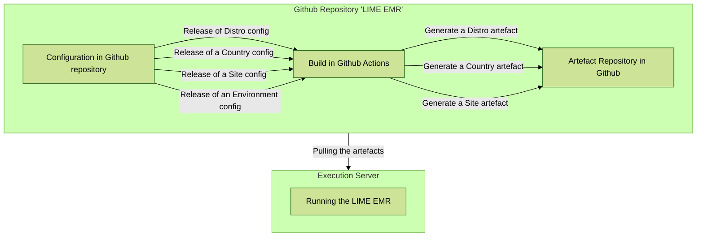

# MSF LIME EMR
Using Ozone Approach

## Configuration hierarchy and inheritance 

### Assumptions
- There are **3 levels** of configurations: Distro < Country < Site
- The default **ineritance logic** is for lower levels to overwrite above ones
- **Configurations** includes backend and frontend binaries, frontend configs, initializer metadata, and assets like logos.
- It **primarly support OpenMRS**, but aims to be flexible and also support Senaite, Superset, OpenFN, FHIR, etc.

#### Hierarchy overview - example
```
── pom.xml - Aggredator / Orchestrator  
      └── /distro/pom.xml - Organizational-wide Config  
      └── /countries - Country-specific Config  
            └── /iraq/pom.xl
      └── /sites - Site-specific Config  
            └── /mosul/pom.xl
```

### Workflow diagram




## Example for configs for hierarchy demo of v1 - Week of April 8
### Ozone Level **OpenMRS RefApp**   
- [x] Refapp stable version of [modules for frontend](https://github.com/openmrs/openmrs-distro-referenceapplication/blob/main/frontend/spa-assemble-config.json)  
- [x] Refapp stable version of [modules for backend](https://github.com/openmrs/openmrs-distro-referenceapplication/blob/main/distro/pom.xml)  
### MSF Distro **LIME EMR** repository  
- [x] MSF [branding in frontend config](https://github.com/MSF-OCG/LIME-EMR-project-demo/blob/main/frontend/custom-config.json)   
- [x] MSF [logo and assets](https://github.com/MSF-OCG/LIME-EMR-project-demo/tree/main/frontend/assets)
- [x] [Env specific logos](https://github.com/MSF-OCG/LIME-EMR-project-demo/blob/dev/frontend/qa/assets/logo.png) for users to easily identify their environment 
### Country level: **Iraq**   
- [x] [Roles config](https://github.com/MSF-OCG/LIME-EMR-project-demo/blob/main/distro/configuration/roles/roles_core-demo.csv) for Initializer  
### Site level: **Mosul**  
- [x] [Address hierarchy](https://github.com/MSF-OCG/LIME-EMR-project-demo/tree/main/distro/configuration/addresshierarchy) for Initializer  
- [x] [Locations](https://github.com/MSF-OCG/LIME-EMR-project-demo/blob/main/distro/configuration/locations/locations.csv) for Initializer  
- [x] [Person attributes](https://github.com/MSF-OCG/LIME-EMR-project-demo/blob/main/distro/configuration/personattributetypes/personattributetypes_core-demo.csv) for Initializer
- [x] [Initial consultation form](https://github.com/MSF-OCG/LIME-EMR-project-demo/blob/main/distro/configuration/ampathforms/initial_consultation-lime_demo.json)


## Quick Start

Build
```bash
./scripts/mvnw clean package
```

Running MSF Distro
```bash
source distro/target/go-to-scripts-dir.sh
./start-demo.sh
```

Running MSF Iraq
```bash
cd countries/iraq/target/ozone-msf-iraq-<version>/run/docker/scripts
./start-demo.sh
```

Running MSF Mosul
```bash
cd sites/mosul/target/ozone-msf-mosul-<version>/run/docker/scripts
./start-demo.sh
```

## Testing

1. Install prerequisites
   brew install jq 
3. Clone EMR Tooling
   
4. Update install directory
   ```bash
   INSTALL_DIR="**.**/home/lime/$APP_NAME"
   ```
5. Disable logging in lime_emr.sh (success and error)
Function to log success messages
```bash
log_success() {
    echo "[$(date +'%Y-%m-%dT%H:%M:%S%z')] Success: $1" # >> "$SUCCESS_LOG"
}
```
Comment out Function to log error messages
```bash
log_error() {
    echo "[$(date +'%Y-%m-%dT%H:%M:%S%z')] Error: $1" # >> "$ERROR_LOG"
}
```
6. Comment out download_msf_artefact() function
```bash
   # curl -L -o "$download_name.zip" -H "$GITHUB_REQUEST_TYPE" -H "$GITHUB_AUTH_HEADER" -H "$GITHUB_API_VERSION" "$download_url" && log_success "Downloaded MSF Distro for the '$artifact_branch' branch." || log_error "Failed to download MSF Distro for the '$artifact_branch' branch."
```
7. Remove docker and package installation if needed

8. Run installation script
   chmod +x ./Procedures/lime_emr.sh
   sh ./Procedures/lime_emr.sh install mosul

## Release Notes

### 1.0.0-SNAPSHOT (in progress)
