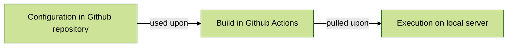

# Ozone MSF
### Workflow diagram


#### Hierarchy overview
```
── pom.xml - Aggredator / Orchestrator  
      └── /distro/pom.xml - Organizational-wide Config  
      └── /countries - Country-specific Config  
            └── /iraq/pom.xl
      └── /sites - Site-specific Config  
            └── /mosul/pom.xl
```
#### How to configure the pom files 
- GroupId
- ArtifactID
- Version

- Dependencies

- Build
- Plugins

- Execution
- Configuration
- Exclude

- DistributionManagement

### 1. Configure
- [ ] Configure the Organization level - MSF  
- [ ] Configure the Country level - Iraq  
- [ ] Configure the Site level - Mosul  
### 2. Build
- [ ] Successfully build the Mosul site distro + above dependencies (Country and Organization levels inherited)
- [ ] Optional: Separate the builds (Org, Country, Site) and make it generic if possible
### 3. Execution
- [ ] Run the OpenMRS Docker Compose with the Mosul distro locally using the updated Shell script (Tooling procedures)
- [ ] Next: Plan for testing on MSF instance 
- [ ] Optional: Run E2E testing

## Config hierarchy
```
── OpenMRS RefApp level - Ozone (ex. base modules, docker images, etc.). 
      └── Org level - MSF Distro - config across MSF implementations _(ex. branding, modules versions, etc. )  
            └── Country level - MSF Iraq specific config (ex. languages)  
                └── Site level - MSF Mosul specific config (ex. address hierarchy, roles, etc.)  
                └── Site level - MSF Baghdad specific config (ex. address hierarchy, roles, etc.)  
            └── Country level - MSF DRC specific config (ex. languages)   
                └── Site level - MSF Goma specific config (ex. modules, locations, etc)  
```

## Example for configs for hierarchy demo of v1 - Week of April 8
### Ozone Level **OpenMRS RefApp**   
- [ ] Refapp stable version of [modules for frontend](https://github.com/openmrs/openmrs-distro-referenceapplication/blob/main/frontend/spa-assemble-config.json)  
- [ ] Refapp stable version of [modules for backend](https://github.com/openmrs/openmrs-distro-referenceapplication/blob/main/distro/pom.xml)  
### MSF Distro **LIME EMR** repository  
- [ ] MSF [branding in frontend config](https://github.com/MSF-OCG/LIME-EMR-project-demo/blob/main/frontend/custom-config.json)   
- [ ] MSF [logo and assets](https://github.com/MSF-OCG/LIME-EMR-project-demo/tree/main/frontend/assets)
- [ ] [Env specific logos](https://github.com/MSF-OCG/LIME-EMR-project-demo/blob/dev/frontend/qa/assets/logo.png) for users to easily identify their environment 
### Country level: **Iraq**   
- [ ] [Roles config](https://github.com/MSF-OCG/LIME-EMR-project-demo/blob/main/distro/configuration/roles/roles_core-demo.csv) for Initializer  
### Site level: **Mosul**  
- [ ] [Address hierarchy](https://github.com/MSF-OCG/LIME-EMR-project-demo/tree/main/distro/configuration/addresshierarchy) for Initializer  
- [ ] [Locations](https://github.com/MSF-OCG/LIME-EMR-project-demo/blob/main/distro/configuration/locations/locations.csv) for Initializer  
- [ ] [Person attributes](https://github.com/MSF-OCG/LIME-EMR-project-demo/blob/main/distro/configuration/personattributetypes/personattributetypes_core-demo.csv) for Initializer
- [ ] [Initial consultation form](https://github.com/MSF-OCG/LIME-EMR-project-demo/blob/main/distro/configuration/ampathforms/initial_consultation-lime_demo.json)


## Ozone documentation
**Ozone MSF** is a distribution of [Ozone HIS](https://www.ozone-his.com).

Please refer to the online Ozone documentation for instructions how to run the project: https://docs.ozone-his.com/create-distro/#available-commands


```
$ git clone https://github.com/mekomsolutions/ozone-msf
$ cd ozone-msf
```

## Quick Start

Build
```bash
./scripts/mvnw clean package
```

Running MSF Distro
```bash
source distro/target/go-to-scripts-dir.sh
./start-demo.sh
```

Running MSF Iraq
```bash
cd countries/iraq/target/ozone-msf-iraq-<version>/run/docker/scripts
./start-demo.sh
```

Running MSF Mosul
```bash
cd sites/mosul/target/ozone-msf-mosul-<version>/run/docker/scripts
./start-demo.sh
```

## Release Notes

### 1.0.0-SNAPSHOT (in progress)
