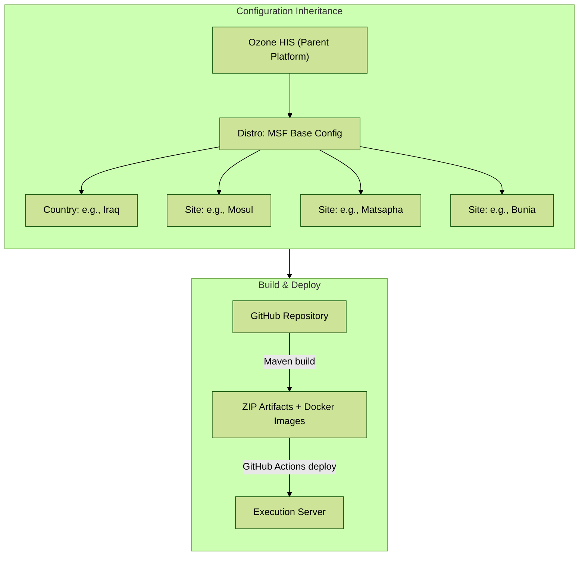
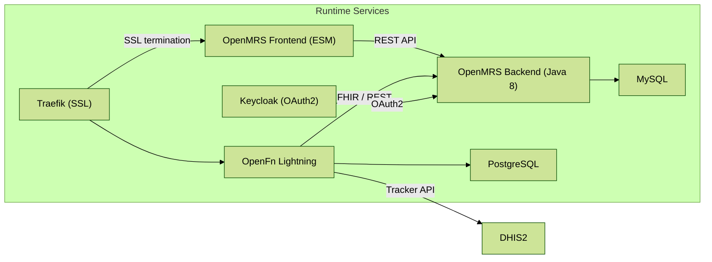
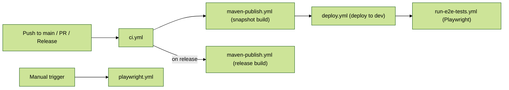

# MSF-OCG LIME EMR

**LIME EMR** (Light Modular EMR) is an [OpenMRS 3](https://openmrs.org/) distribution built by [MSF](https://www.msf.org/) OCG (Operational Centre Geneva), operated and maintained by [Madiro Labs](https://madiro.org/). It provides a generic, modular Electronic Medical Record system for humanitarian healthcare settings, with multi-site deployments across Iraq, Eswatini, and DRC.

The system is built on the [Ozone HIS](https://www.ozone-his.com/) platform and integrates with [DHIS2](https://dhis2.org/) for health information reporting, [OpenFn](https://www.openfn.org/) for workflow automation, [OpenConceptLab](https://openconceptlab.org/) for terminology management, and [HL7 FHIR](https://www.hl7.org/fhir/) for health data interoperability.

[](https://github.com/MSF-OCG/LIME-EMR/actions/workflows/ci.yml)
[](https://github.com/MSF-OCG/LIME-EMR/actions/workflows/build-all.yml)
[](https://github.com/MSF-OCG/LIME-EMR/actions/workflows/configuration-build-test.yml)
[](https://deepwiki.com/MSF-OCG/LIME-EMR)

<table>
  <tr>
    <td rowspan="3" width="70%">
      
    </td>
    <td>
      
    </td>
  </tr>
  <tr>
    <td>
      
    </td>
  </tr>
  <tr>
    <td>
      
    </td>
  </tr>
</table>

**Full technical documentation**: [https://msf-ocg.github.io/LIME-EMR](https://msf-ocg.github.io/LIME-EMR) -- architecture deep-dives, deployment guides, operations runbooks, and development references are maintained on the Docsify documentation site.

---

## Table of Contents

1. [Overview](#1-overview)
2. [Architecture](#2-architecture)
3. [Quick Start](#3-quick-start)
   - 3.1 [Distro](#31-distro)
   - 3.2 [Site](#32-site)
4. [Project Structure](#4-project-structure)
   - 4.1 [Inheritance Hierarchy](#41-inheritance-hierarchy)
   - 4.2 [Adding a New Site](#42-adding-a-new-site)
   - 4.3 [Build System](#43-build-system)
5. [Features](#5-features)
   - 5.1 [Infrastructure](#51-infrastructure)
     - 5.1.1 [HTTPS](#511-https)
     - 5.1.2 [Bundled Docker](#512-bundled-docker)
     - 5.1.3 [CI/CD](#513-cicd)
   - 5.2 [Configuration](#52-configuration)
     - 5.2.1 [OpenMRS](#521-openmrs)
       - 5.2.1.1 [Clinical Forms](#5211-clinical-forms)
       - 5.2.1.2 [Address Hierarchy](#5212-address-hierarchy)
     - 5.2.2 [OpenFn](#522-openfn)
       - 5.2.2.1 [Project Workflows and State Files](#5221-project-workflows-and-state-files)
       - 5.2.2.2 [Credentials](#5222-credentials)
   - 5.3 [Clinical Features](#53-clinical-features)
     - 5.3.1 [Patient Flags](#531-patient-flags)
     - 5.3.2 [Follow-up Tables](#532-follow-up-tables)
     - 5.3.3 [Tasks](#533-tasks)
6. [Deployment Infrastructure](#6-deployment-infrastructure)
   - 6.1 [Single-Command VPS Deployment](#61-single-command-vps-deployment)
   - 6.2 [Bundled Docker Stack](#62-bundled-docker-stack)
   - 6.3 [CI/CD Pipeline](#63-cicd-pipeline)
   - 6.4 [FiWi Production Deployment — Manual Process](#64-fiwi-production-deployment--manual-process)
   - 6.5 [Multi-Level Configuration Inheritance](#65-multi-level-configuration-inheritance)
   - 6.6 [Hosting Strategy](#66-hosting-strategy)
   - 6.7 [Data Protection and Patient Safety](#67-data-protection-and-patient-safety)
7. [How To](#7-how-to)
8. [Contributing](#8-contributing)
9. [Release Notes](#9-release-notes)

---

## 1. Overview

LIME EMR is a **generic, light, modular** Electronic Medical Record system designed for MSF's humanitarian healthcare operations. It is built on [OpenMRS 3](https://openmrs.org/) and the [Ozone HIS](https://www.ozone-his.com/) distribution platform.

### Current Deployment Sites

| Site | Country | Clinical Forms | Description |
|------|---------|---------------|-------------|
| **Distro** (MSF base) | -- | 26 forms | Core programs: mental health (MHPSS/mhGAP v2), family planning, HIV, social work, gynaecology, surgery/anaesthesia, procedures/transfusion, wound dressing, radiology, referral & discharge |
| **LIME Demo** | -- | 26 forms (distro only) | Generic showcase environment. Runs the distro level directly with no site-specific overrides — used to demonstrate new OpenMRS versions and features without affecting project-specific configurations. |
| **Mosul** | Iraq | 77 total (51 site-specific + 26 from distro) | Full hospital: obstetrics, ER, maternity, paediatrics, neonatology, ICU, infectious diseases (TB/HBV/HCV/NCDs), palliative care, nutrition, NTDs, and specialized programs. Arabic/English. DHIS2 sync via OpenFn. Live in production since 2024. |
| **Matsapha** | Eswatini | Inherits distro | Site with custom branding, address hierarchy, ID generation, and OpenFn configuration |
| **Bunia** | DRC | Inherits distro | Site with custom branding, address hierarchy, ID generation, roles, and OpenFn configuration |

### Key Capabilities

- **Clinical forms** -- 77+ JSON-based forms across mental health, surgery, obstetrics, infectious diseases, and more
- **Multilingual** -- Arabic and English UI and form translations
- **Role-based access control** -- Role-based forms, appointments, encounters, and data filtering
- **Data exchange** -- Real-time OpenMRS to DHIS2 Tracker synchronization via OpenFn (live in production across all sites)
- **Interoperability** -- FHIR R4 API, OpenConceptLab terminology, REST web services
- **Multi-site** -- Three-level configuration inheritance (Distro, Country, Site), with active deployments in Iraq, Eswatini, and DRC
- **Containerized** -- Docker Compose orchestration with Traefik SSL, automated backups, and single-command VPS provisioning

### Ambitions and Success Criteria

- **Integrated** -- with OpenMRS ecosystem and community roadmap
- **Innovative** -- leveraging modern technology and approaches
- **Sustainable** -- using well maintained and documented tools and practices
- **Open** -- using open-source software and licenses allowing for reusability
- **Data driven** -- quality information available to the right people when they need it
- **Quality of care** -- address tangible needs from healthcare workers and patients
- **Relevant** -- content and patient flows representative of use cases defined by healthcare workers
- **Harmonized** -- content following global standards such as ICD, SNOMED, etc.
- **Portable** -- agnostic architecture, containerization, and orchestration
- **Adaptable** -- content and configuration management that can easily be updated
- **Recoverable** -- recommendations for a solid backup and recovery strategy
- **Testable** -- automated testing and reporting whenever possible
- **Secure** -- architecture and practices to meet GDPR and HIPAA regulations
- **Reliable** -- recommendations to support redundancy, failover, and monitoring by design
- **Interoperable** -- to support Health Information Exchange (HIE) and standards such as HL7 FHIR
- **Collaborative** -- share information, insights, strategies and deliverables within the community
- **Achievable** -- taking into account the overall roadmap and challenges of implementers

---

## 2. Architecture

LIME EMR follows a **three-level configuration inheritance model** designed for multi-site humanitarian deployments:

1. **Distro** (`/distro`) -- Organization-wide MSF base configuration. Defines backend modules, frontend modules, core clinical forms, concept dictionaries, drug lists, roles, and branding shared across all MSF sites.
2. **Country** (`/countries/<name>`) -- Country-specific overrides (e.g., Iraq-specific metadata or roles).
3. **Site** (`/sites/<name>`) -- Site-specific overrides. Adds address hierarchies, locations, ID generation, site-specific clinical forms, translations, and OpenFn workflows for a particular facility.

Each lower level inherits everything from the level above and can selectively override or extend any configuration file. The build system (Maven) orchestrates this by unpacking the parent artifact, then copying and excluding files at each level.


```mermaid
%%{init: {'theme':'forest'}}%%
flowchart TD
    subgraph Inheritance["Configuration Inheritance"]
        direction TB
        OZONE["Ozone HIS (Parent Platform)"] --> DISTRO["Distro: MSF Base Config"]
        DISTRO --> COUNTRY["Country: e.g., Iraq"]
        DISTRO --> SITE_A["Site: e.g., Mosul"]
        DISTRO --> SITE_B["Site: e.g., Matsapha"]
        DISTRO --> SITE_C["Site: e.g., Bunia"]
    end

    subgraph Build["Build & Deploy"]
        direction TB
        GH["GitHub Repository"] -->|Maven build| ARTIFACTS["ZIP Artifacts + Docker Images"]
        ARTIFACTS -->|GitHub Actions deploy| SERVER["Execution Server"]
    end

    Inheritance --> Build
```

### Runtime Services

The system runs as a set of Docker containers orchestrated by Docker Compose:


```mermaid
%%{init: {'theme':'forest'}}%%
flowchart LR
    subgraph Services["Runtime Services"]
        direction TB
        OPENMRS_BE["OpenMRS Backend (Java 8)"]
        OPENMRS_FE["OpenMRS Frontend (ESM)"]
        MYSQL["MySQL"]
        OPENFN["OpenFn Lightning"]
        POSTGRES["PostgreSQL"]
        TRAEFIK["Traefik (SSL)"]
        KEYCLOAK["Keycloak (OAuth2)"]
    end

    OPENMRS_FE -->|REST API| OPENMRS_BE
    OPENMRS_BE --> MYSQL
    OPENFN --> POSTGRES
    OPENFN -->|FHIR / REST| OPENMRS_BE
    OPENFN -->|Tracker API| DHIS2["DHIS2"]
    TRAEFIK -->|SSL termination| OPENMRS_FE
    TRAEFIK --> OPENFN
    KEYCLOAK -->|OAuth2| OPENMRS_BE
```

### Technology Stack

| Layer | Technologies |
|-------|-------------|
| **Backend** | OpenMRS Core 2.7.7, Java 8, 20+ OpenMRS modules (FHIR2, Initializer, Appointments, Queue, Forms, Reporting, etc.) |
| **Frontend** | OpenMRS 3 ESM microfrontend architecture (41 modules), plus custom Madiro modules (Nutrition, Mental Health) |
| **Data exchange** | OpenFn Lightning for DHIS2 sync, FHIR R4 API, OpenConceptLab |
| **Infrastructure** | Docker Compose, Traefik v2.6 (SSL), Keycloak (OAuth2), MySQL, PostgreSQL |
| **Build** | Apache Maven (multi-module aggregator), GitHub Actions CI/CD, GitHub Packages |
| **Testing** | Playwright v1.49.0 (E2E), BrowserStack |

---

## 3. Quick Start

### Prerequisites

- Java 8+
- Maven 3.x (a Maven wrapper `./scripts/mvnw` is included)
- Docker and Docker Compose
- A GitHub personal access token configured in `~/.m2/settings.xml` (see [Build System](#43-build-system))

### Build

```bash
./scripts/mvnw clean package
```

### 3.1 Distro

Run the base MSF distribution (organization-wide defaults):

```bash
source distro/target/go-to-scripts-dir.sh
./start-demo.sh
```

> OpenMRS will be available at `http://localhost:4001/openmrs`.
> To change the port, modify `PROXY_PUBLIC_PORT` in `/run/docker/.env`.

### 3.2 Site

Run a specific site (includes all distro configuration plus site-specific overrides):

**Mosul (Iraq):**
```bash
cd sites/mosul/target/ozone-msf-mosul-<version>/run/docker/scripts
./start-demo.sh
```

**Matsapha (Eswatini):**
```bash
cd sites/matsapha/target/ozone-msf-matsapha-<version>/run/docker/scripts
./start-demo.sh
```

**Bunia (DRC):**
```bash
cd sites/bunia/target/ozone-msf-bunia-<version>/run/docker/scripts
./start-demo.sh
```

**Iraq (country-level, without site-specific config):**
```bash
cd countries/iraq/target/ozone-msf-iraq-<version>/run/docker/scripts
./start-demo.sh
```

---

## 4. Project Structure

```
LIME-EMR/
├── pom.xml                              # Root Maven aggregator
├── distro/                              # Organization-wide (MSF) base configuration
│   ├── pom.xml                          # Backend module versions & build plugins
│   └── configs/openmrs/
│       ├── frontend_assembly/           # spa-assemble-config.json (frontend module versions)
│       ├── frontend_config/             # msf-frontend-config.json (branding, UI settings)
│       └── initializer_config/          # Base clinical metadata
│           ├── ampathforms/             # 14 clinical form definitions (JSON)
│           ├── concepts/                # Medical concept definitions
│           ├── drugs/                   # Drug database
│           ├── encountertypes/          # Encounter type definitions
│           ├── patientidentifiertypes/  # Patient ID types
│           ├── roles/                   # User roles
│           ├── privileges/              # System privileges
│           ├── globalproperties/        # OpenMRS global properties
│           └── ...                      # Additional initializer domains
├── countries/
│   └── iraq/                            # Country-level overrides for Iraq
│       └── configs/openmrs/initializer_config/
├── sites/
│   ├── mosul/                           # Mosul site (Iraq)
│   │   ├── configs/openmrs/
│   │   │   ├── initializer_config/
│   │   │   │   ├── ampathforms/         # 75+ site-specific clinical forms
│   │   │   │   ├── ampathformstranslations/  # Arabic & English translations
│   │   │   │   ├── addresshierarchy/    # Iraq geographic hierarchy
│   │   │   │   ├── locations/           # Facility locations
│   │   │   │   └── idgen/               # Patient ID generation
│   │   │   └── frontend_config/         # msf-mosul-frontend-config.json
│   │   └── configs/openfn/              # OpenFn workflows for DHIS2 sync
│   ├── matsapha/                        # Matsapha site (Eswatini)
│   │   ├── configs/openmrs/             # Address hierarchy, locations, ID generation
│   │   └── configs/openfn/              # OpenFn workflow configuration
│   └── bunia/                           # Bunia site (DRC)
│       ├── configs/openmrs/             # Address hierarchy, locations, ID generation, roles
│       └── configs/openfn/              # OpenFn workflow configuration
├── environment/                         # Environment-specific branding (QA, UAT, Prod)
├── scripts/                             # Docker Compose files, build utilities, env files
├── e2e/                                 # Playwright end-to-end tests
├── docs/                                # Technical documentation
└── .github/workflows/                   # CI/CD pipelines
```

### 4.1 Inheritance Hierarchy

The project is a Maven multi-module aggregator. Each module inherits from the level above and can override any configuration file.

```
pom.xml                          # Root aggregator / orchestrator
├── distro/pom.xml               # Organization-wide config (MSF)
├── countries/iraq/pom.xml       # Country config (inherits distro)
├── sites/mosul/pom.xml          # Site config (inherits distro)
├── sites/matsapha/pom.xml       # Site config (inherits distro)
└── sites/bunia/pom.xml          # Site config (inherits distro)
```

**How inheritance works at build time:**

1. **Download** -- Maven downloads the parent level's artifact (ZIP) from GitHub Packages
2. **Unpack** -- The artifact is unpacked into the build directory
3. **Exclude** -- Files that the current level overrides are excluded via `maven-resources-plugin`
4. **Copy** -- The current level's own configuration files are copied on top
5. **Post-process** -- Groovy scripts merge OpenFn YAML files; AntRun updates `.env` variables
6. **Package** -- The result is packaged as a new ZIP artifact

**Configuration types that can be overridden at each level:**
- Backend OpenMRS modules (JARs)
- Frontend ESM modules (JS bundles)
- Frontend JSON config files (branding, UI widgets, dashboards)
- Initializer metadata (CSV/JSON: forms, concepts, drugs, roles, locations, etc.)
- Static assets (logos, branding images)
- OpenFn workflow definitions (YAML)
- Docker Compose overrides

**Frontend config inheritance** uses `SPA_CONFIG_URLS` in the Docker `.env` file to load multiple JSON configs in order, with later files overriding earlier ones:
```properties
# Distro-level only:
SPA_CONFIG_URLS=/openmrs/spa/configs/msf-frontend-config.json

# Site-level (inherits distro + adds site overrides):
SPA_CONFIG_URLS=/openmrs/spa/configs/msf-frontend-config.json,/openmrs/spa/configs/msf-mosul-frontend-config.json
```

### 4.2 Adding a New Site

To add a new site (e.g., `sites/newsite`), follow these steps:

**Step 1. Create the directory structure:**

```
sites/newsite/
├── pom.xml
├── assembly.xml
└── configs/
    ├── openmrs/
    │   ├── frontend_config/
    │   │   └── msf-newsite-frontend-config.json
    │   └── initializer_config/
    │       ├── addresshierarchy/         # Site-specific address hierarchy CSV + XML
    │       ├── locations/                # Facility location definitions
    │       ├── idgen/                    # Patient ID generation schemes
    │       ├── visittypes/               # Visit type definitions
    │       ├── appointmentservicedefinitions/
    │       └── ...                       # Any other overrides
    └── openfn/
        ├── newsite-project.yaml          # OpenFn workflow definitions
        ├── projectState.json             # OpenFn credentials and project metadata
        ├── adaptor_registry_cache.json   # Cached OpenFn adaptor versions
        └── version.txt
```

**Step 2. Create `pom.xml`** -- Use `sites/matsapha/pom.xml` as a template. Key elements:

```xml
<groupId>com.ozonemsf</groupId>
<artifactId>ozone-msf-newsite</artifactId>
<version>1.0.0-SNAPSHOT</version>
<packaging>pom</packaging>

<dependencies>
  <dependency>
    <artifactId>ozone-msf-distro</artifactId>
    <groupId>com.ozonemsf</groupId>
    <version>1.0.0-SNAPSHOT</version>
    <type>zip</type>
  </dependency>
</dependencies>
```

The pom.xml must include Maven plugins to:
- **Unpack** the distro artifact (`maven-dependency-plugin`)
- **Exclude** distro files being replaced (`maven-resources-plugin`) -- typically `addresshierarchy`, `locations`, `idgen`, `visittypes`, `appointmentservicedefinitions`
- **Copy** site-specific configs on top (`maven-resources-plugin`)
- **Update** the `.env` file with the site frontend config URL (`maven-antrun-plugin`)
- **Merge** OpenFn YAML files (`gmavenplus-plugin` with `merge-openfn-yaml.groovy`)
- **Package** as ZIP (`maven-assembly-plugin`)

**Step 3. Create `assembly.xml`** -- Copy from any existing site (they are identical):

```xml
<assembly>
  <id>zip</id>
  <formats><format>zip</format></formats>
  <includeBaseDirectory>false</includeBaseDirectory>
  <fileSets>
    <fileSet>
      <outputDirectory>.</outputDirectory>
      <directory>${project.build.directory}/${project.artifactId}-${project.version}</directory>
    </fileSet>
  </fileSets>
</assembly>
```

**Step 4. Register the module** in the root `pom.xml`:

```xml
<modules>
  <module>distro</module>
  <module>countries/iraq</module>
  <module>sites/mosul</module>
  <module>sites/matsapha</module>
  <module>sites/newsite</module>    <!-- Add this line -->
</modules>
```

**Step 5. Build and verify:**

```bash
./scripts/mvnw clean package -pl sites/newsite -am
cd sites/newsite/target/ozone-msf-newsite-<version>/run/docker/scripts
./start-demo.sh
```

> A detailed step-by-step guide for adding a new site is also available in [`setting_up_new_site.md`](setting_up_new_site.md), using Matsapha as a worked example.

### 4.3 Build System

The project uses **Apache Maven** as its build system, organized as a multi-module aggregator.

#### Maven Profiles

| Profile | Description |
|---------|-------------|
| `local` (default) | Uses `local.msf.env`, Traefik disabled |
| `azure` | Uses `azure.msf.env`, Traefik enabled with SSL |
| `production` | Sets Docker tag to `latest` |
| `bundled-docker` | Builds Docker images with multi-platform support (see [Bundled Docker](#512-bundled-docker)) |

#### Key Maven Plugins

| Plugin | Purpose |
|--------|---------|
| `maven-dependency-plugin` | Unpacks parent-level ZIP artifacts |
| `maven-resources-plugin` | Copies/excludes/filters configuration files between levels |
| `maven-antrun-plugin` | Replaces frontend config references and other strings in `.env` files |
| `gmavenplus-plugin` | Runs Groovy scripts (e.g., merging OpenFn YAML files, generating `ozone-info.json`) |
| `maven-assembly-plugin` | Packages the final ZIP artifact |
| `merge-maven-plugin` | Merges `.env` files from multiple sources |
| `docker-maven-plugin` (Fabric8) | Builds and pushes Docker images (bundled-docker profile) |

#### Maven Configuration

Add GitHub Packages credentials to `~/.m2/settings.xml`:

```xml
<servers>
  <server>
    <id>msf-ocg-github-lime-emr</id>
    <username>YOUR_GITHUB_USERNAME</username>
    <password>YOUR_GITHUB_TOKEN</password>
  </server>
</servers>
```

See [creating a personal access token](https://docs.github.com/en/authentication/keeping-your-account-and-data-secure/managing-your-personal-access-tokens#creating-a-fine-grained-personal-access-token) for token setup.

---

## 5. Features

### 5.1 Infrastructure

#### 5.1.1 HTTPS

LIME EMR supports HTTPS via **Traefik v2.6** as a reverse proxy with automatic SSL certificates from [traefik.me](https://traefik.me).

**To enable HTTPS:**
```bash
export TRAEFIK="true" && ./start-demo.sh
```

**How it works:**
- An init container (`reverse-proxy-https-helper`) downloads wildcard SSL certificates from traefik.me
- Traefik terminates SSL and proxies requests to the OpenMRS frontend, OpenFn Lightning, and other services
- Domains are generated dynamically using the server's IP address:
  - `https://api-<IP>.traefik.me` -- OpenMRS
  - `https://openfn-<IP>.traefik.me` -- OpenFn Lightning
- The Traefik admin dashboard is protected with basic authentication (`TRAEFIK_ADMIN_USER` / `TRAEFIK_ADMIN_PASSWORD`)
- Ports: HTTP (80) and HTTPS (443)

> **Note**: With SSL enabled, OpenMRS remains locally accessible at `http://localhost:4001/openmrs`.

**For Azure deployments**, set the `ORIGINS` environment variable in the OpenFn environment file to include the Azure domain.

#### 5.1.2 Bundled Docker

The `bundled-docker` Maven profile builds pre-configured Docker images and pushes them to Docker Hub under the `msfocg` registry.

**Activate with:**
```bash
./scripts/mvnw clean package -Pbundled-docker
```

**Images built (8 total):**

| Image | Platforms | Description |
|-------|-----------|-------------|
| `msfocg/<site>-openmrs-backend` | amd64, arm64 | OpenMRS backend with all modules pre-installed |
| `msfocg/<site>-openmrs-frontend` | amd64, arm64 | OpenMRS frontend SPA with all ESM modules |
| `msfocg/<site>-proxy` | amd64, arm64 | Nginx reverse proxy |
| `msfocg/<site>-mysql` | amd64, arm64 | MySQL with pre-loaded database |
| `msfocg/<site>-postgresql` | amd64, arm64 | PostgreSQL with OpenFn database init scripts |
| `msfocg/<site>-openfn-web` | amd64 only | OpenFn Lightning web application |
| `msfocg/<site>-openfn-worker` | amd64 only | OpenFn worker with workflows and project state |

**Tag strategy:**
- `dev` tag by default
- `latest` tag when built with the `production` profile

At the site level, the bundled Docker build also injects site-specific OpenFn configuration (workflow YAML, project state, adaptor cache) into the OpenFn worker and web images.

#### 5.1.3 CI/CD

The project uses **GitHub Actions** for continuous integration and deployment. Workflows are defined in `.github/workflows/`.


```mermaid
%%{init: {'theme':'forest'}}%%
flowchart LR
    PUSH["Push to main / PR / Release"] --> CI["ci.yml"]
    CI --> SNAPSHOT["maven-publish.yml (snapshot build)"]
    SNAPSHOT --> DEPLOY["deploy.yml (deploy to dev)"]
    DEPLOY --> E2E["run-e2e-tests.yml (Playwright)"]
    CI -->|on release| RELEASE["maven-publish.yml (release build)"]
    MANUAL["Manual trigger"] --> PLAYWRIGHT["playwright.yml"]
```

| Workflow | Trigger | Purpose |
|----------|---------|---------|
| `ci.yml` | Push to `main`, PRs, releases, manual | Main orchestrator -- chains build, deploy, and test jobs |
| `maven-publish.yml` | Called by `ci.yml` | Builds all Maven modules, publishes to GitHub Packages and Docker Hub |
| `deploy.yml` | Called by `ci.yml` | Deploys to target environment (dev/UAT) with optional Traefik SSL |
| `run-e2e-tests.yml` | Called by `ci.yml` | Runs Playwright E2E tests against deployed environment |
| `playwright.yml` | Manual dispatch | Standalone Playwright test execution |
| `build-all.yml` | Push to `main`, manual | Full build and deploy using GitHub-hosted runners (with disk cleanup) |
| `build-all-vm.yml` | Manual dispatch | Full build and deploy on self-hosted runner |
| `configuration-build-test.yml` | PR | Validates that configuration builds succeed |
| `cleanup-artifacts.yml` | Scheduled | Removes old build artifacts |

**E2E Testing** uses [Playwright](https://playwright.dev/) v1.49.0 with Chromium. Test coverage includes:
- OpenMRS and OpenFn login flows
- Mental health form workflows (MHPSS baseline, mhGAP baseline/follow-up)
- Answer-based question filtering
- Arabic/English translation verification
- Visit management

```bash
# Run all E2E tests locally
yarn test:e2e

# Run only login tests
yarn test:login
```

Environment variables (`.env`): `OPENMRS_BASE_URL`, `OPENMRS_USERNAME`, `OPENMRS_PASSWORD`, `OPENFN_BASE_URL`, `OPENFN_EMAIL`, `OPENFN_PASSWORD`.

This project is also tested with **BrowserStack**.

---

### 5.2 Configuration

#### 5.2.1 OpenMRS

OpenMRS configuration covers the backend modules, frontend microfrontends, and clinical metadata loaded by the [Initializer module](https://github.com/mekomsolutions/openmrs-module-initializer).

**Backend module versions** are defined in [`distro/pom.xml`](distro/pom.xml) (OpenMRS Core 2.7.7, 20+ modules including FHIR2, Initializer, Appointments, Queue, Forms, Reporting, Stock Management, Billing, Bed Management, etc.).

**Frontend module versions** are defined in [`distro/configs/openmrs/frontend_assembly/spa-assemble-config.json`](distro/configs/openmrs/frontend_assembly/spa-assemble-config.json) (Core UI 8.0.1, 40+ ESM modules plus custom Madiro Nutrition and Mental Health apps).

**Initializer metadata** is loaded from CSV and JSON files in the `configs/openmrs/initializer_config/` directory at each level. Supported domains include:

| Domain | Description |
|--------|-------------|
| `ampathforms` | Clinical form definitions (JSON) |
| `ampathformstranslations` | Form UI translations (Arabic/English) |
| `concepts` / `conceptsources` | Medical concept definitions and source mappings |
| `drugs` | Drug database |
| `encountertypes` | Encounter type definitions |
| `patientidentifiertypes` | Patient ID type definitions |
| `personattributetypes` | Person attribute type definitions |
| `roles` / `privileges` | User roles and system privileges |
| `globalproperties` | OpenMRS global properties |
| `jsonkeyvalues` | Key-value configuration entries |
| `locations` / `locationtags` | Facility locations and location tags |
| `addresshierarchy` | Geographic address hierarchy (site-level) |
| `idgen` / `autogenerationoptions` | Patient ID generation schemes |
| `visittypes` | Visit type definitions |
| `appointmentservicedefinitions` / `appointmentservicetypes` | Appointment service configuration |
| `flags` / `flagpriorities` / `flagtags` | Patient flag definitions and categories |
| `drools` | Drools rule engine configurations |
| `systemtasks` | Scheduled system task definitions |
| `messageproperties` | i18n message property overrides |
| `liquibase` | Custom database migration scripts |
| `ocl` | OpenConceptLab reference terminology imports |

Backend configuration inheritance uses the `maven-resources-plugin` `copy-resources` goal to copy files from the parent level while selectively excluding files that the current level overrides. Frontend configuration inheritance uses the `maven-antrun-plugin` to append site-specific config URLs to the `SPA_CONFIG_URLS` variable in the Docker `.env` file.

##### 5.2.1.1 Clinical Forms

Clinical forms are JSON-based and use the [OpenMRS O3 form engine](https://openmrs.atlassian.net/wiki/spaces/projects/pages/68747273/O3+Form+Docs). They are stored in the `ampathforms/` subdirectory of the Initializer configuration at each level.

**Distro-level forms** (26 forms shared across all sites):
- **Mental health** (7 forms): PHQ-9, MHPSS baseline/follow-up/closure v2, mhGAP baseline/follow-up/closure v2
- **Family planning** (2 forms): Assessment, follow-up
- **HIV** (2 forms): Baseline, follow-up
- **Social work** (2 forms): Baseline, follow-up
- **Surgery & anaesthesia** (7 forms): Surgical safety checklist, operative report, admission/discharge, pre-anaesthesia record, recovery, anaesthesia transfer
- **Procedures & transfusion** (3 forms): Small procedure report, pre-donation, blood transfusion
- **Gynaecology** (1 form)
- **Referral & discharge** (1 form)
- **Wound dressing** (1 form)
- **Radiology request** (1 form)

**Mosul site-specific forms** (51 additional forms -- 77 total when combined with distro):
- **Obstetrics**: ANC, PNC, obstetric ultrasound, maternity triage/admission/delivery/discharge, cervical cancer
- **Neonatology**: Delivery, admission, discharge
- **Paediatrics**: Admission, discharge
- **Adult medicine**: Admission, discharge
- **Emergency & triage**: ER triage/consultation/exit, OPD general, ATFC
- **Nutrition**: ITFC admission/discharge, feeding form
- **Infectious diseases**: NCDs, TB, HBV, HCV (baseline & follow-up), travel medicine
- **Palliative care & ICU**: Baseline/follow-up, ICU admission/discharge
- **Specialized programs**: Snakebites, cholera, dengue, filariasis, schistosomiasis, POCUS
- **Mental health (legacy v1)**: PHQ-9 v1, MHPSS baseline/follow-up/closure, mhGAP baseline/follow-up/closure

**Advanced form features:**
- **Answer-based question filtering** -- Show or hide questions based on selected answers
- **Role-based write privileges** -- Restrict which fields a user can edit based on their role
- **Previous observation retrieval** -- Pre-populate form fields with data from prior encounters
- **Score calculations** -- Automatic scoring (e.g., PHQ-9 depression score, Child-Pugh score)
- **Multilingual translations** -- Arabic and English form translations stored in the `ampathformstranslations/` directory (see [`docs/translations.md`](docs/translations.md))

##### 5.2.1.2 Address Hierarchy

Each site defines its geographic address hierarchy via the [Address Hierarchy module](https://github.com/openmrs/openmrs-module-addresshierarchy). The configuration consists of two files in `configs/openmrs/initializer_config/addresshierarchy/`:

**1. `addressConfiguration.xml`** -- Defines the hierarchy levels and display format:

```xml
<addressConfiguration>
  <addressComponents>
    <addressComponent>
      <field>COUNTRY</field>
      <nameMapping>Location.country</nameMapping>
      <elementDefault>Iraq</elementDefault>
    </addressComponent>
    <addressComponent>
      <field>STATE_PROVINCE</field>
      <nameMapping>Location.province</nameMapping>
    </addressComponent>
    <addressComponent>
      <field>COUNTY_DISTRICT</field>
      <nameMapping>Location.district</nameMapping>
    </addressComponent>
    <addressComponent>
      <field>CITY_VILLAGE</field>
      <nameMapping>Location.village</nameMapping>
    </addressComponent>
  </addressComponents>
  <addressHierarchyFile>
    <filename>addresshierarchy_iraq.csv</filename>
    <entryDelimiter>,</entryDelimiter>
    <identifierDelimiter>%</identifierDelimiter>
  </addressHierarchyFile>
</addressConfiguration>
```

**2. `addresshierarchy_<country>.csv`** -- The hierarchy data in CSV format:

```csv
Iraq,Ninawa,Mosul,Al Ayadya%e7LLNpajpID
Iraq,Ninawa,Mosul,Al Bosaif%ay9g9DNz6Yp
Iraq,Ninawa,Mosul,Al Jazaer%Fr6wsGwvBzJ
Iraq,Dihok,Akre,Akre Center%abc123xyz
```

Each row follows the pattern: `COUNTRY,STATE_PROVINCE,COUNTY_DISTRICT,CITY_VILLAGE%<UUID>`. The UUID after the `%` delimiter is the OpenMRS address hierarchy entry identifier.

At the site level, the distro's address hierarchy files are excluded and replaced with site-specific ones.

#### 5.2.2 OpenFn

[OpenFn](https://www.openfn.org/) automates data exchange between OpenMRS and DHIS2 Tracker. It runs as Docker containers (Lightning web app, worker, and PostgreSQL database) defined in `scripts/docker-compose-openfn.yml`. OpenFn is live in production across all deployment sites.

##### 5.2.2.1 Project Workflows and State Files

OpenFn configuration lives in `configs/openfn/` at each level. Three key files define a site's OpenFn setup:

**1. `<site>-project.yaml`** -- Workflow definitions. This is the main configuration file that defines OpenFn projects, workflows, jobs, triggers, and edges. Example structure:

```yaml
workflows:
  wf1-dhis2-omrs-migration:
    name: wf1-dhis2-omrs-migration
    jobs:
      Fetch-Metadata:
        name: Fetch Metadata
        adaptor: '@openfn/language-http@6.5.1'
        body: |
          // JavaScript job code for data transformation
      Map-DHIS2-to-OpenMRS:
        name: Map DHIS2 to OpenMRS
        adaptor: '@openfn/language-fhir@1.0.0'
        body: |
          // FHIR-based mapping logic
```

**Workflow YAML inheritance** follows the same model as the rest of the configuration. A Groovy script (`scripts/merge-openfn-yaml.groovy`) merges all `.yaml` files in `configs/openfn/` at each level into a single `openfn-project.yaml` at compile time.

Rules:
- File name can be anything except `openfn-project.yaml` (which is the merged output)
- Files must have a `.yaml` extension
- Files must be in `configs/openfn/` at the appropriate level
- At site level, the parent's compiled `openfn-project.yaml` is excluded and the merge script runs again to combine all workflow files from the current level

**2. `projectState.json`** -- Project metadata and credential references. Contains the OpenFn project ID, name, retention policies, and a mapping of credential names to their IDs:

```json
{
  "id": "69066751-5f2c-459c-b42e-feba1c802383",
  "name": "msf-lime-mosul",
  "history_retention_period": 90,
  "dataclip_retention_period": 90,
  "project_credentials": {
    "owner@openfn.org-OpenMRS-Demo": {
      "id": "45634fcb-...",
      "name": "OpenMRS Demo",
      "owner": "owner@openfn.org"
    },
    "owner@openfn.org-MSF-DHIS2-UAT": {
      "id": "9716980f-...",
      "name": "MSF DHIS2 UAT",
      "owner": "owner@openfn.org"
    }
  }
}
```

**3. `adaptor_registry_cache.json`** -- A local cache of available OpenFn adaptors and their versions. This prevents repeated registry lookups and improves startup performance:

```json
[
  {
    "name": "@openfn/language-http",
    "versions": [{"version": "1.0.0"}, {"version": "6.5.1"}],
    "latest": "6.5.1"
  },
  {
    "name": "@openfn/language-dhis2",
    "versions": [...],
    "latest": "..."
  }
]
```

In the **bundled Docker** build, these files are copied directly into the OpenFn worker and web Docker images so workflows and state are available at container startup.

##### 5.2.2.2 Credentials

OpenFn credentials (API keys, passwords, connection strings for OpenMRS, DHIS2, etc.) are **not stored in the repository**. The `projectState.json` file only contains credential **references** (IDs and names), not the actual secret values.

Actual credential values are managed through:
- **OpenFn Lightning UI** -- Credentials are created and managed in the OpenFn web interface
- **Environment variables** -- Connection details are passed via Docker environment variables (`OPENFN_ENDPOINT`, `SECRET_KEY`, `ORIGINS`, etc.)
- **`.env` files** -- Stored in `scripts/secrets/` (e.g., `local.msf.env`, `azure.msf.env`) and merged at build time

For Docker deployments, the OpenFn environment requires:
```sh
ERL_FLAGS="+JPperf true"    # Required to avoid ArgumentError at startup
ORIGINS="http://your-domain.com"  # Allowed CORS origins (set for Azure deployments)
```

---

### 5.3 Clinical Features

#### 5.3.1 Patient Flags

Patient Flags are automatic clinical alerts that surface in the patient chart when specific conditions are detected — abnormal vitals, critical lab results, high-risk medications, missed appointments, and more.

**How it works:** The [Drools](https://www.drools.org/) rule engine evaluates patient data in real-time against configured rules. When a rule matches, a flag appears as a colored alert in the relevant dashboard tab of the patient chart.

**18 pre-configured flags (distro level):**

| Flag | Trigger | Priority | Tag |
|------|---------|----------|-----|
| Allergy | Any active allergy recorded | High | Patient Safety |
| HighBloodPressure | Systolic BP above threshold | High | Vitals |
| LowBloodPressure | Systolic BP below threshold | High | Vitals |
| HighHeartRate | Heart rate above threshold | High | Vitals |
| LowHeartRate | Heart rate below threshold | High | Vitals |
| LowOxygenSaturation | SpO₂ below threshold | High | Vitals |
| Fever | Temperature > 39.5°C (patients older than 1 year) | Medium | Vitals |
| HighWBC | High white blood cell count | Medium | Labs |
| LowHemoglobin | Severe anemia threshold | High | Labs |
| HighINR | Bleeding risk threshold | High | Labs |
| CriticalPotassium | Potassium outside safe range | High | Labs |
| AcuteKidneyInjury | AKI indicator | Medium | Labs |
| HighRiskMeds | High-risk medication prescribed | Low | Medications |
| HighRiskConds | High-risk condition recorded | High | High Risk Conditions |
| ChronicConditions | Chronic condition recorded | Low | Chronic Conditions |
| InfectiousDisease | Infectious disease condition recorded | High | Infections Disease Conditions |
| PendingSurgery | Pending surgery recorded | Low | Procedures |
| MissedAppointment | Missed clinic appointment | Low | Appointments |

**UI placement:** Flags are filtered by tag and surface in the relevant patient chart dashboard tab:

| Dashboard tab | Tags shown |
|--------------|------------|
| Test Results | Labs |
| Summary | Patient Safety, Medications |
| Medications | Patient Safety, Medications |
| Conditions | Chronic Conditions |
| Appointments | Appointments |

**Status:** Enabled at distro level (LIME Demo). Disabled at site level for Mosul, Matsapha, and Bunia pending clinical validation at each deployment.

**Configuration files:**
- Flag definitions: `distro/configs/openmrs/initializer_config/flags/flags.csv`
- Drools evaluation rules: `distro/configs/openmrs/initializer_config/drools/<flag-name>/rules/`
- Frontend widget placement: `msf-frontend-config.json` → `patient-flags-list` extension in `@openmrs/esm-patient-chart-app` slots

See [How to enable Patient Flags at a site](#how-to-enable-patient-flags-at-a-site).

---

#### 5.3.2 Follow-up Tables

The follow-up table is a horizontal observation widget that appears in the **Test Results** tab of the patient chart. It displays selected clinical observations across all visits in chronological order — enabling at-a-glance longitudinal tracking of any configured concept.

**Key configuration properties:**

| Property | Distro default | Description |
|----------|---------------|-------------|
| `title` | "Follow up table demo" | Widget header shown in the UI |
| `oldestFirst` | `true` | Displays visits left-to-right chronologically |
| `editable` | `true` | Allows inline editing of observations |
| `encounterTypeToCreateUuid` | Visit Note encounter type UUID | Encounter type used when saving new values |
| `data` | Height (cm), Weight (kg) + 2 additional vitals | Concepts rendered as columns |

The distro ships Height and Weight as a baseline. Any numeric or text observation concept can be added as a column.

**Status:** Enabled at distro level and inherited by all sites.

**Configuration file:** `distro/configs/openmrs/frontend_config/msf-frontend-config.json` → `obs-table-horizontal-widget` under `patient-chart-test-results-dashboard-slot`

See [How to configure Follow-up Table columns](#how-to-configure-follow-up-table-columns).

---

#### 5.3.3 Tasks

The Tasks feature provides structured clinical task management — healthcare workers can assign, track, and complete predefined tasks linked to clinical activities (documentation, coordination, monitoring, medication, and procedures).

**62 pre-configured tasks across 6 categories:**

| Category | Example tasks |
|----------|--------------|
| Documentation | Obtain patient consent for surgery, Fill death certificate, Complete discharge summary, Scan documents into EMR |
| Coordination | Organise patient transfer between wards, Organise specialist referral, Organise discharge |
| Monitoring | Monitor vital signs, Monitor blood pressure, Monitor oxygen saturation, Monitor fluid balance |
| Assessment | Measure height/weight, Measure MUAC |
| Medication | Dispense medication, Administer prescribed medication, Discontinue medication |
| Procedures | Insert/remove IV line, Collect lab samples, Insert urinary catheter, Change dressing |

**Access:** Tasks are accessed through the dedicated **Tasks app** in the main navigation. The service queues dashboard link is intentionally removed from the homepage across all configurations to consolidate task access in the dedicated app.

**Roles:** All clinical roles (General role and roles inheriting from it) have task view and management privileges by default via `Get Queue Entries` and `Manage Queue Entries` privileges.

**Status:** Enabled at distro level and inherited by all sites.

**Configuration file:** `distro/configs/openmrs/initializer_config/systemtasks/systemtasks.csv`

See [How to add a custom Task](#how-to-add-a-custom-task).

---

## 6. Deployment Infrastructure

This section describes the deployment automation and operational infrastructure that enables LIME EMR to run continuously across MSF field sites. These tools are maintained in the private [LIME-EMR-Tooling](https://github.com/MSF-OCG/LIME-EMR-Tooling) repository and operated by [Madiro Labs](https://madiro.org/).

### 6.1 Single-Command VPS Deployment

A deployment orchestrator script (`deploy-lime.sh`) takes a fresh Ubuntu VPS from bare metal to a fully running LIME instance in a single command, organized in four sequential phases:

```
┌─────────────────────────────────────────────────────────────────┐
│                      deploy-lime.sh                             │
│                                                                 │
│  Phase 1 ──  VPS Security Hardening         (secure-vps.sh)    │
│  Phase 2 ──  Docker & Package Installation  (bundled_docker_…) │
│  Phase 3 ──  Pull Bundled-Docker Scripts    (pull_bundled_…)   │
│  Phase 4 ──  Start LIME Instance            (start-bundled-…)  │
│                                                                 │
│  Output:  Running LIME EMR on a hardened VPS with HTTPS         │
└─────────────────────────────────────────────────────────────────┘
```

The four phases cover: server security hardening, Docker installation, pulling the Bundled-Docker orchestration scripts, and starting the full LIME service stack (Traefik + OpenMRS + OpenFn + databases).

This replaced a multi-hour manual provisioning process. A new site environment can be provisioned in under 30 minutes. Full documentation and usage instructions are in the [`LIME-EMR-Tooling` repository](https://github.com/MSF-OCG/LIME-EMR-Tooling).

### 6.2 Bundled Docker Stack

All services run as a single Docker Compose stack behind a Traefik reverse proxy:

- **Traefik** handles HTTPS termination with automatic Let's Encrypt certificate provisioning
- **OpenMRS** Frontend + Backend + MariaDB
- **OpenFn** Lightning + Worker + PostgreSQL
- One Compose configuration per environment profile (`local`, `dev`, `uat`, `prod`)
- Environment-specific secrets and configuration managed via per-instance environment files

The stack runs 10+ containers and is designed to fit on a single VPS with 8 GB RAM.

### 6.3 CI/CD Pipeline

The GitHub Actions pipeline follows a build-deploy-test chain that runs automatically on code changes:

- **Automated deployment**: Pushes to `main` trigger a snapshot build, automated deployment to the dev environment, and Playwright E2E tests — all without manual intervention
- **Release gating**: Published GitHub Releases trigger a production build, deploy to UAT, and E2E tests. Failed E2E tests block the deployment pipeline
- **Environment isolation**: Dev and UAT environments run on independent infrastructure with separate databases containing only synthetic test data
- **Docker Hub publishing**: All site images are built and pushed to Docker Hub (`msfocg/<site>-*`) as part of the pipeline
- **Production deployment**: FiWi field production VMs are updated manually by an authorized operator — automated runners cannot reach MSF-managed field infrastructure (see [section 6.4](#64-fiwi-production-deployment--manual-process))

### 6.4 FiWi Production Deployment — Manual Process

MSF field production VMs (FiWi) run on MSF-managed on-premises infrastructure behind VPN — automated CI/CD runners cannot reach them directly. Production deployments are therefore **manual** and must be triggered by an authorized operator with appropriate network access.

The deployment flow: a GitHub Release triggers Docker image builds to Docker Hub, then an operator connects to the field VM, pulls the latest orchestration scripts, and starts the updated stack.

See [`LIME-EMR-Tooling` documentation](https://github.com/MSF-OCG/LIME-EMR-Tooling) for the full operator runbook and access prerequisites.

### 6.5 Multi-Level Configuration Inheritance

The three-level Maven hierarchy ensures configuration is not duplicated across sites:

```
Distro (MSF base -- 26 forms, shared modules)
  └── Country (Iraq / Eswatini / DRC -- country-specific config)
        └── Site (Mosul / Matsapha / Bunia -- site-specific forms, concepts, users)
```

Adding a new site inherits everything from the distro and country levels automatically. Only site-specific overrides (address hierarchy, locations, ID generation, branding, and any additional clinical forms) need to be added. See [Adding a New Site](#42-adding-a-new-site) for the step-by-step process.

### 6.6 Hosting Strategy

Dev and UAT environments run on cloud VPS instances managed by Madiro, providing cost-predictable hosting for the full container stack. The CI/CD toolchain (GitHub Actions, Docker Hub) works identically across hosting providers.

Production environments run on MSF-managed on-premises infrastructure and require manual operator deployment as described in [section 6.4](#64-fiwi-production-deployment--manual-process).

### 6.7 Data Protection and Patient Safety

Patient data in LIME EMR deployments is subject to strict data residency and isolation requirements:

- **Patient data stays on-premises**: Real patient records exist only on MSF-managed field infrastructure (FiWi VMs). Patient data is never transmitted to, stored on, or processed by external cloud infrastructure.
- **Dev and UAT contain no real patient data**: Development and UAT environments run exclusively with synthetic test data. Importing real patient records into these environments is not permitted.
- **Data minimization**: Only data necessary for patient care is collected and retained. Retention periods follow MSF data governance policies.
- **Access control**: Role-based access ensures clinical data is accessible only to authorized healthcare workers at the relevant site.

For full data residency specifications, backup procedures, and compliance documentation, see the [LIME-EMR-Tooling](https://github.com/MSF-OCG/LIME-EMR-Tooling) operational documentation.

---

## 7. How To

### How to add or update clinical concepts

Clinical concepts (diagnoses, observations, medications, coded answers) are managed through [OpenConceptLab (OCL)](https://openconceptlab.org/) and loaded into OpenMRS via the Initializer module.

**Workflow:**
1. Search for existing concepts in the CIEL source — prefer reuse over creating new ones
2. If no CIEL concept exists, create a new concept in the MSF OCG source on OCL
3. Add all required concepts to an OCL collection (per program or per form)
4. Release the collection and export it as a ZIP file
5. Place the ZIP in `configs/openmrs/initializer_config/ocl/` at the appropriate level (distro or site)
6. Build and restart OpenMRS — the Initializer loads concepts automatically

> Full workflow, UUID generation formula, and drug list management: [Content Management documentation](https://msf-ocg.github.io/LIME-EMR/#/content-management)

### How to add a new clinical form

1. Create a JSON form definition following the [O3 form engine schema](https://openmrs.atlassian.net/wiki/spaces/projects/pages/68747273/O3+Form+Docs)
2. Place the file in `configs/openmrs/initializer_config/ampathforms/` at the appropriate level (distro for all sites, or a specific site directory)
3. If translations are needed, add translation files in the `ampathformstranslations/` directory
4. Build and verify: `./scripts/mvnw clean package`

### How to override a distro configuration at site level

1. Place your override file in the site's `configs/` directory with the same relative path
2. In the site's `pom.xml`, add an `<exclude>` in the `maven-resources-plugin` execution to remove the parent's version:
   ```xml
   <exclude>distro/configs/**/ampathforms/F01-My_Form.json</exclude>
   ```
3. The site's copy will be used instead

### How to remove a frontend app from the site level

To remove (hide) a frontend app for a specific site without affecting other sites, edit the site's frontend configuration JSON file (e.g., `sites/<site-name>/configs/openmrs/frontend_config/msf-<site-name>-frontend-config.json`).

**Option A: Remove the app's extensions from specific slots**

Use the `"remove"` property in an `extensionSlots` configuration to hide the app's UI elements from the page:

```json
{
  "@openmrs/esm-patient-home-app": {
    "extensionSlots": {
      "homepage-dashboard-slot": {
        "remove": ["service-queues-dashboard-link"]
      }
    }
  }
}
```

This is useful when you want to remove specific widgets or dashboard links contributed by an app, while keeping other parts of the app available.

**Option B: Restrict the app using Display conditions**

Set `"Display conditions"` with a privilege that no role at the site has, effectively hiding it from all users:

```json
{
  "@openmrs/esm-dispensing-app": {
    "Display conditions": {
      "privileges": ["Some Privilege Not Granted At This Site"]
    }
  }
}
```

**Option C: Remove importmap entries via the build (site-level)**

Add a `gmavenplus-plugin` execution in the site's `pom.xml` that runs the `remove-importmap-entries.groovy` script. This strips the specified modules from the importmap at build time so they are never loaded for that site:

```xml
<execution>
  <id>remove-importmap-entries</id>
  <goals>
    <goal>execute</goal>
  </goals>
  <phase>process-resources</phase>
  <configuration>
    <properties>
      <property>
        <name>modulesToRemove</name>
        <value>esm-mental-health-app,esm-nutrition-app</value>
      </property>
    </properties>
    <scripts>
      <script>file://${project.basedir}/../../scripts/remove-importmap-entries.groovy</script>
    </scripts>
  </configuration>
</execution>
```

Pass a comma-separated list of module names (without the `@openmrs/` or `@madiro/` scope prefix) in the `modulesToRemove` property.

**Option D: Exclude the app from the build entirely (distro-level)**

If the app should be excluded from **all** sites, add it to the `frontendModuleExcludes` array in `distro/configs/openmrs/frontend_assembly/spa-assemble-config.json`:

```json
{
  "frontendModuleExcludes": [
    "@openmrs/esm-some-app"
  ]
}
```

> **Note:** Options A and B are configuration-level overrides -- they hide the app's UI via the site's frontend config JSON. Option C removes the app from the importmap at build time for a single site. Option D is a distro-level change that excludes the app from the build for all sites.

### How to add a new OpenFn workflow

1. Create a `.yaml` file in `configs/openfn/` at the desired level
2. The Groovy merge script will automatically include it in the compiled `openfn-project.yaml`
3. Update `projectState.json` if the workflow requires new credentials

### How to run E2E tests locally

1. Copy `.env.example` to `.env` and fill in the environment variables
2. Install dependencies: `yarn install`
3. Run all tests: `yarn test:e2e`
4. Run login tests only: `yarn test:login`

### How to enable HTTPS locally

```bash
export TRAEFIK="true" && ./start-demo.sh
```

### How to build bundled Docker images

```bash
./scripts/mvnw clean package -Pbundled-docker
# For production tags:
./scripts/mvnw clean package -Pbundled-docker -Pproduction
```

### How to set up automated backups with Restic

LIME EMR uses [Restic](https://restic.readthedocs.io/) via the [`mekomsolutions/restic-compose-backup`](https://github.com/mekomsolutions/restic-compose-backup) Docker image for automated, encrypted, and deduplicated backups of Docker volumes (MySQL/MariaDB for OpenMRS and PostgreSQL for OpenFn).

**Step 1. Create a backup directory:**

```bash
sudo mkdir -p ~/backups/restic_data
sudo chmod 700 ~/backups/restic_data
sudo chown $USER:$USER ~/backups/restic_data
```

**Step 2. Configure backup environment variables** in `run/docker/concatenated.env`:

```bash
BACKUP_PATH=~/backups/restic_data
RESTIC_PASSWORD=your-strong-password-here
RESTIC_KEEP_DAILY=7
RESTIC_KEEP_WEEKLY=4
RESTIC_KEEP_MONTHLY=6
RESTIC_KEEP_YEARLY=2
LOG_LEVEL=INFO
CRON_SCHEDULE=0 0 * * *
```

**Step 3. Start LIME** with `./start.sh` or `./start-with-sso.sh`. The backup container (`docker-compose-backup.yml`, inherited from Ozone) runs automatically alongside the other services.

See [`docs/restic_backup.md`](docs/restic_backup.md) for the full Restic backup reference.

### How to perform a manual database backup

For ad-hoc backups outside of the Restic automation, use `mysqldump` for the OpenMRS database and `pg_dump` for the OpenFn database:

**MySQL/MariaDB (OpenMRS):**
```bash
docker exec openmrs-db /usr/bin/mysqldump \
  --max_allowed_packet=512M \
  -u openmrs --password='<password>' \
  openmrs --skip-lock-tables --single-transaction --skip-triggers \
  | gzip > openmrs_backup_$(date +%Y%m%d).sql.gz
```

**PostgreSQL (OpenFn):**
```bash
docker exec openfn-postgresql pg_dump \
  -U hello lightning_prod \
  | gzip > openfn_backup_$(date +%Y%m%d).sql.gz
```

### How to restore from a Restic backup

**Step 1. List available snapshots:**
```bash
docker exec backup restic snapshots
```

**Step 2. Restore a snapshot** (replace `<snapshot-id>` with the target snapshot):
```bash
docker exec backup restic restore <snapshot-id> --target /
```

**Step 3. Restart services** to pick up the restored data:
```bash
docker compose down && docker compose up -d
```

For restoring from a manual SQL dump instead:

**MySQL/MariaDB (OpenMRS):**
```bash
gunzip < openmrs_backup_20250101.sql.gz | docker exec -i openmrs-db mysql -u openmrs --password='<password>' openmrs
```

**PostgreSQL (OpenFn):**
```bash
gunzip < openfn_backup_20250101.sql.gz | docker exec -i openfn-postgresql psql -U hello lightning_prod
```

### How to encrypt and transfer backups offsite

For additional security and offsite redundancy beyond Restic's built-in encryption:

**Step 1. Install GPG and generate a key pair** (one-time setup on the backup server):
```bash
sudo apt-get install gnupg
gpg --gen-key
```

**Step 2. Encrypt a backup file:**
```bash
gpg --encrypt --recipient "Your Name" openmrs_backup_20250101.sql.gz
```

**Step 3. Transfer to an offsite server:**
```bash
scp -i /path/to/backup_key openmrs_backup_20250101.sql.gz.gpg backup@remote-server:/backups/
```

For ongoing file-level replication, use `rsync`:
```bash
rsync -a --delete ~/backups/restic_data/ backup@remote-server:/backups/restic_data/
```

### How to enable Patient Flags at a site

Flags are enabled at the distro level (LIME Demo). To enable them at a specific site:

1. In the site's frontend config (`sites/<site>/configs/openmrs/frontend_config/msf-<site>-frontend-config.json`), add `"patient-flags"` to the feature flags list:
   ```json
   "@openmrs/esm-app-shell": {
     "Enabled feature flags": ["enable-embedded-form-view", "patient-flags"]
   }
   ```
2. The Drools rules and flag definitions are inherited from the distro — no additional metadata files are needed
3. Optionally adjust which tag groups appear on each dashboard slot by configuring `patient-flags-list` in the relevant `extensionSlots` entry
4. Build and deploy: `./scripts/mvnw clean package`

### How to configure Follow-up Table columns

The follow-up table columns are defined by a list of concept UUIDs in the frontend config:

1. Edit `msf-frontend-config.json` at the appropriate level (distro or site)
2. Locate the `obs-table-horizontal-widget` configuration under `patient-chart-test-results-dashboard-slot`
3. Add or replace entries in the `data` array — each entry is a concept UUID:
   ```json
   "obs-table-horizontal-widget": {
     "title": "My Follow-up Table",
     "oldestFirst": true,
     "editable": true,
     "encounterTypeToCreateUuid": "<encounter-type-uuid>",
     "data": [
       {"concept": "<concept-uuid-1>"},
       {"concept": "<concept-uuid-2>"}
     ]
   }
   ```
4. Each concept UUID must exist in the OpenMRS concept dictionary — see [How to add or update clinical concepts](#how-to-add-or-update-clinical-concepts)
5. Build and deploy: `./scripts/mvnw clean package`

To override this at site level, follow the standard [config inheritance pattern](#how-to-override-a-distro-configuration-at-site-level).

### How to add a custom Task

Tasks are defined as CSV rows and loaded by the Initializer module on startup:

1. Open `configs/openmrs/initializer_config/systemtasks/systemtasks.csv` at the appropriate level (distro for shared tasks, site for site-specific tasks)
2. Add a new row with the following columns:

   | Column | Description | Example |
   |--------|-------------|---------|
   | `Uuid` | Unique UUID v4 | `a1b2c3d4-e5f6-...` |
   | `Name` | Machine-readable slug | `check-wound-dressing` |
   | `Title` | Human-readable task name | `Check wound dressing` |
   | `Description` | Category path shown in UI | `Monitoring > Wound Care` |
   | `Priority` | `High`, `Medium`, or `Low` | `Medium` |
   | `Default Assignee Role` | Role name (optional) | `Nurse` |
   | `Rationale` | Free text note (optional) | |

3. Build and restart — the Initializer loads new tasks automatically on startup
4. No additional frontend configuration is needed — new tasks appear in the task-list app immediately

---

## 8. Contributing

LIME EMR is an open-source project and contributions are welcome. Here are ways to get involved:

- **Report issues** -- Open a [GitHub issue](https://github.com/MSF-OCG/LIME-EMR/issues) for bugs, feature requests, or questions
- **Submit pull requests** -- Fork the repository, create a feature branch, and submit a PR against `main`
- **Clinical forms** -- If you have experience with OpenMRS O3 forms, contributions to the form library are particularly valuable
- **Documentation** -- Improvements to the [documentation site](https://msf-ocg.github.io/LIME-EMR) are always appreciated
- **Testing** -- Help expand Playwright E2E test coverage

Before contributing, please review the existing [project structure](#4-project-structure) and [build system](#43-build-system) documentation to understand the codebase layout. PRs are validated by the `configuration-build-test.yml` workflow, which checks that configuration builds succeed.

For detailed architecture documentation, development guides, and operations runbooks, see the **[full documentation site](https://msf-ocg.github.io/LIME-EMR)**.

---

## 9. Release Notes

See [`docs/CHANGE_LOG.md`](docs/CHANGE_LOG.md) for the full sprint-by-sprint release history.

### Roadmap

- [ ] Implement **merge logic for frontend config JSONs** at the site level (lower level overwrites higher level on conflict)
- [ ] Replicate similar **merge logic for Initializer configuration files**
- [ ] Simplify **build output** to produce a single artifact at the execution (Site) level
- [ ] Optimize **GitHub Actions builds** to trigger only the relevant level on release or manual dispatch
- [ ] **Remove Country level** — flatten hierarchy to Distro → Site; `countries/iraq/` contains no active configuration, simplifying the Maven build graph and CI triggers
- [ ] **Expand E2E test suite** — CI currently runs only 2 login tests (`yarn test:login`); extend coverage to core clinical workflows (form submission, patient registration, appointments)
- [ ] **Document Matsapha and Bunia forms** — add site-specific form lists to Section 5.2.1.1 (currently only Mosul and Distro are documented)
